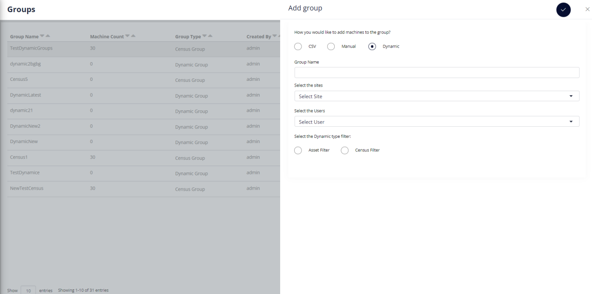
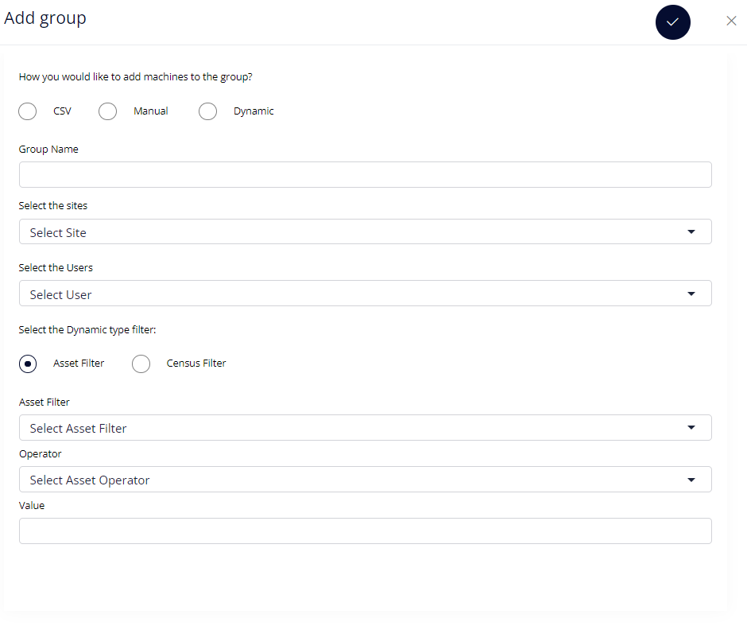
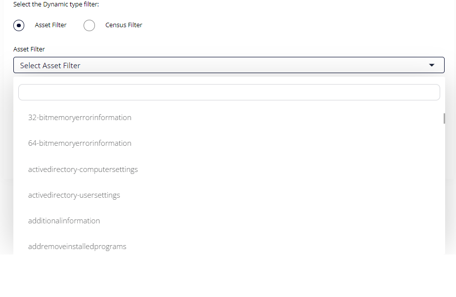
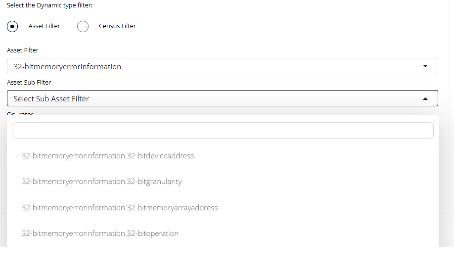
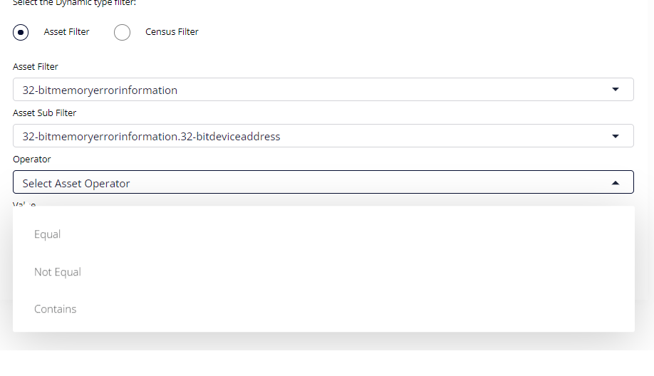
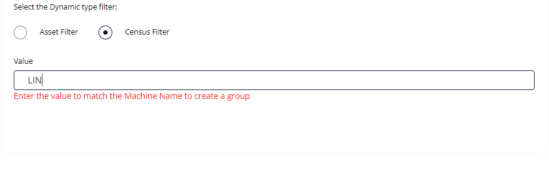

# DYNAMIC GROUPS 
```
UI File : 

Dashboard/device/device_html.php 
```
 
```
JS File :  

Dashboard/js/customer/advgrp.js 

Dashboard/js/customer/device.js 
```
Click on Add Group on the menu option.



```
The Dynamic Groups has two options:

1.  Asset Filter - Creating a group based on Asset Filters.

2.  Census Filter - Filtering devices matching the value provided while creating the group.
```

```
    Dynamic Group - ASSET FILTER
```

```
    For creating either a Asset Filter Group or Census Filter Group, following details are mandatory:


1.  Group Name

2.  Sites from which the groups will be created.

3.  The List of Users.
```


```
1.  When the user selects the asset filter , the following options will
    be displayed.

2.  Whenever an asset filter is selected, the dropdown for asset sub
    filter will appear to select the sub filter.

3.  Three asset operators - Equals,Not Equals,Contains are provided to
    filter data using these operators.

4.  Value needs to provided which will match with the Asset Filter.
```





```
    DYNAMIC GROUPS - CENSUS FILTER

    For Creating a Dynamic Group based on Census data, we need to
    provide the Value which needs to be matched in the Census table.

```




  ------------------- ---------------------------------------------------------------------------
 <table>
<colgroup>
<col style="width: 27%" />
<col style="width: 72%" />
</colgroup>
<tbody>
<tr class="odd">
<td><strong>For Asset Group Creation:</strong></td>
<td></td>
</tr>
<tr class="even">
<td>JS Function</td>
<td><p>createDynamicAssetGrp</p>
</tr>
<tr class="odd">
<td>PHP/API Call</td>
<td>Dashboard/admin/groupfunctions.php/createAdvanceGrp</td>
</tr>
<tr class="even">
<td>Type</td>
<td>POST </td>
</tr>
<tr class="odd">
<td>Conditions required to satisfy the call</td>
<td>gname,userlist,searchString,searchtype,searchval,sitelist,csrfMagicToken, action</td>
</tr>
<tr class="even">
<td>Success Response</td>
<td>Advance Group has been successfully added </td>
</tr>
<tr class="odd">
<td>Failure Response</td>
<td>No machine has been updated/Group name already exists</td>
</tr>
</tbody>
</table>

  ------------------- ---------------------------------------------------------------------------

 <table>
<colgroup>
<col style="width: 27%" />
<col style="width: 72%" />
</colgroup>
<tbody>
<tr class="odd">
<td><strong>For Census Group Creation:</strong></td>
<td></td>
</tr>
<tr class="even">
<td>JS Function</td>
<td><p>createDynamicCensusGrp</p>
</tr>
<tr class="odd">
<td>PHP/API Call</td>
<td>Dashboard/admin/groupfunctions.php/createAdvanceGrp</td>
</tr>
<tr class="even">
<td>Type</td>
<td>POST </td>
</tr>
<tr class="odd">
<td>Conditions required to satisfy the call</td>
<td>gname,userlist,searchString,searchtype,searchval,sitelist,csrfMagicToken, action</td>
</tr>
<tr class="even">
<td>Success Response</td>
<td>Advance Group has been successfully added </td>
</tr>
<tr class="odd">
<td>Failure Response</td>
<td>No machine has been updated/Group name already exists</td>
</tr>
</tbody>
</table>


  --------- --------------------- ---------------------------------------------------------------------------------------------------------
   <table>
<colgroup>
<col style="width: 27%" />
<col style="width: 72%" />
</colgroup>
<tbody>
<tr class="even">
<td>Type</td>
<td>Database.Table</td>
<td>Columns</td>
</tr>
<tr class="odd">
<td>Insert Data </td>
<td>core.MachineGroups </td>
<td>name,username,global,human,style,created,eventquery,eventspan,assetquery,boolstring,mgroupuniq,mcatuniq</td>
</tr>
<tr class="even">
<td>Insert Data </td>
<td>core.GroupMappings</td>
<td>groupid, groupname, username</td>
</tr>
</tbody>
</table>   

---------------------------

```
Database changes:

Created a new table asset.assetFilters to save the Dynamic Census and
Asset Groups.
```
**CREATE** **TABLE** asset.assetFilters (

\`id\` **INT**(10) **NOT** **NULL** **AUTO_INCREMENT**,

\`site\` **VARCHAR**(50) **NULL** **DEFAULT** **NULL** **COLLATE**
\'latin1_swedish_ci\',

\`grpname\` **VARCHAR**(50) **NULL** **DEFAULT** **NULL** **COLLATE**
\'latin1_swedish_ci\',

\`stringVal\` **VARCHAR**(50) **NULL** **DEFAULT** **NULL** **COLLATE**
\'latin1_swedish_ci\',

\`dataid\` **VARCHAR**(50) **NULL** **DEFAULT** **NULL** **COLLATE**
\'latin1_swedish_ci\',

\`str\` **VARCHAR**(50) **NULL** **DEFAULT** **NULL** **COLLATE**
\'latin1_swedish_ci\',

\`operator\` **VARCHAR**(50) **NULL** **DEFAULT** **NULL** **COLLATE**
\'latin1_swedish_ci\',

\`grptype\` **VARCHAR**(50) **NULL** **DEFAULT** **NULL** **COLLATE**
\'latin1_swedish_ci\',

**PRIMARY** **KEY** (\`id\`) **USING** **BTREE**

)

**COLLATE**=\'latin1_swedish_ci\'

**ENGINE**=**InnoDB**

**AUTO_INCREMENT**=0

;
