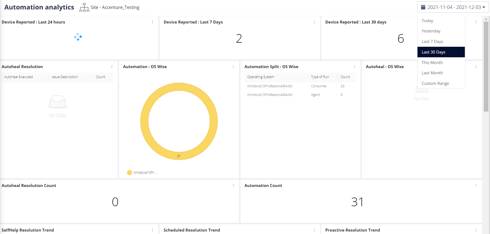

# DATEPICKER DASHBOARD



```
The functionality was added to make the Dashboard data filter on a
particular date range.

The DateRange picker is implemented using the following JS plugin :

<https://www.daterangepicker.com>
```
------------------------------------------------
```
The Ranges can be :

1.  Today

2.  Yesterday

3.  Last 7 days

4.  Last 30 days

5.  This Month

6.  Last Month

7.  Custom Range
```
------------------------------------------------
```
    The following part of code is responsible for rendering the
    Daterangepicker.

    File Name : Dashboard/js/home/home.js

\$(function() {

    var start = moment().subtract(29, \'days\');

    var end = moment();

    var time = start.format(\"YYYY-MM-DD\") +

        \" 00:00:00.000,\" +

        end.format(\"YYYY-MM-DD\") +

        \" 23:59:59.999\";

    \$(\'#reportrange span\').html(start.format(\"YYYY-MM-DD\") + \' -
\' + end.format(\"YYYY-MM-DD\"));

    \$(\'#CubeDateString\').val(\'Last 30 Days\');

    \$(\'#reportrange\').daterangepicker({

        \"showDropdowns\": true,

        \"maxSpan\": {

            \"days\": 30

        },

        ranges: {

            \'Today\': \[moment(), moment()\],

            \'Yesterday\': \[moment().subtract(1, \'days\'),
moment().subtract(1, \'days\')\],

            \'Last 7 Days\': \[moment().subtract(6, \'days\'),
moment()\],

            \'Last 30 Days\': \[moment().subtract(29, \'days\'),
moment()\],

            \'This Month\': \[moment().startOf(\'month\'),
moment().endOf(\'month\')\],

            \'Last Month\': \[moment().subtract(1,
\'month\').startOf(\'month\'), moment().subtract(1,
\'month\').endOf(\'month\')\]

        },

        \"startDate\": start,

        \"endDate\": end,

        \"autoApply\": false,

    }, function(start, end, label) {

        if(label == \'Custom Range\'){

            label = start.format(\"YYYY-MM-DD\") +

            \" 00:00:00.000,\" +

            end.format(\"YYYY-MM-DD\") +

            \" 23:59:59.999\";

        }

        \$(\'#CubeDateString\').val(label);

        \$(\'#reportrange span\').html(start.format(\"YYYY-MM-DD\") +
\' - \' + end.format(\"YYYY-MM-DD\"));

        loadLandingpage();

    });

});

\$(\'#reportrange\').on(\'apply.daterangepicker\', function(ev, picker)
{

    var label = picker.startDate.format(\"YYYY-MM-DD\") +

        \" 00:00:00.000,\" +

        picker.endDate.format(\"YYYY-MM-DD\") +

        \" 23:59:59.999\";

    \$(\'#CubeDateString\').val(label);

    \$(\'#reportrange span\').html(start.format(\"YYYY-MM-DD\") + \' -
\' + end.format(\"YYYY-MM-DD\"));

    loadLandingpage();

  });
```
------------------------------------------------
```
The Date Range will be updated to the Cubejs Url like this:

https://pov.nanoheal.com/visualization/#/userdashboard?dashid=907&username=admin&combined=false&schemaId=3&type=site&filter=Accenture_Testing&header=false&dateFilter=Last
30 Days
```