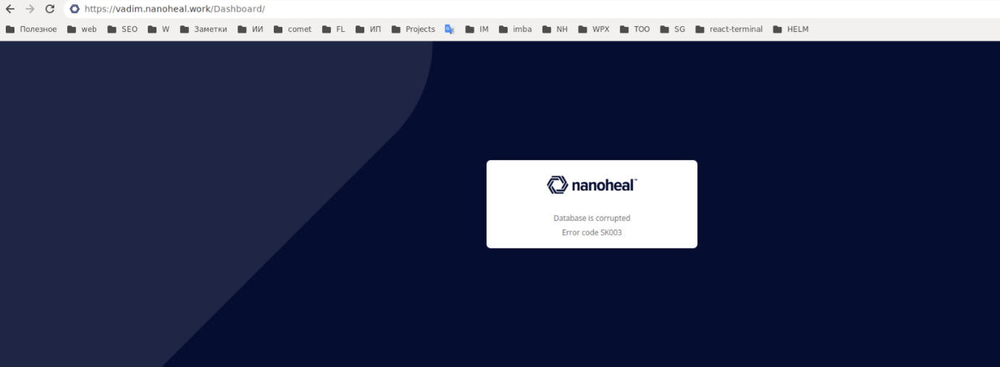
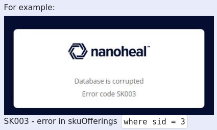

Tokens are checking once in 15 minutes.

- SK00\*\*\* - error in skuOfferings table
- SE00\*\*\* - in Siteemail table
- SI00\*\*\* - in Sites table

--

# How to fix it:

- For dev image you can open this page `https://vadim.nanoheal.work/Dashboard/nhmysql/tokenReCalc.php`. It should recalculate all tokens.
- For prod builds url will not work. You can run dev build, call this url and comeback to prod builds. Also you can copy data from one db to anothere.
