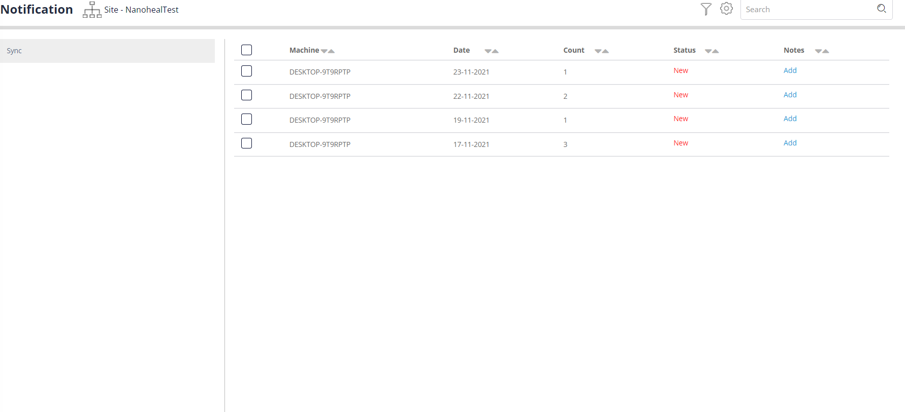
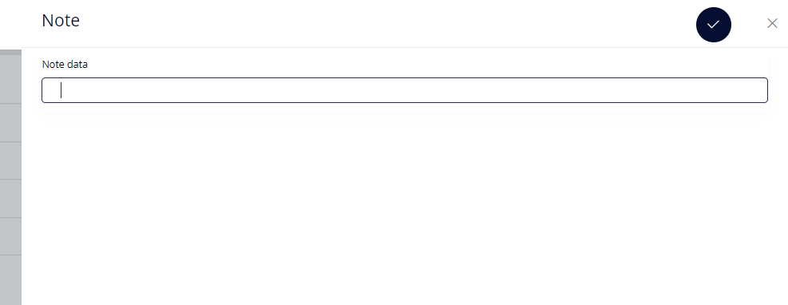
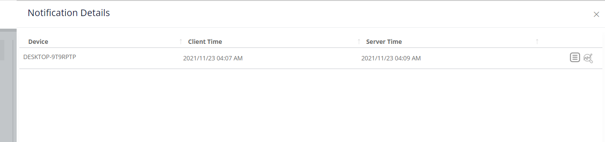
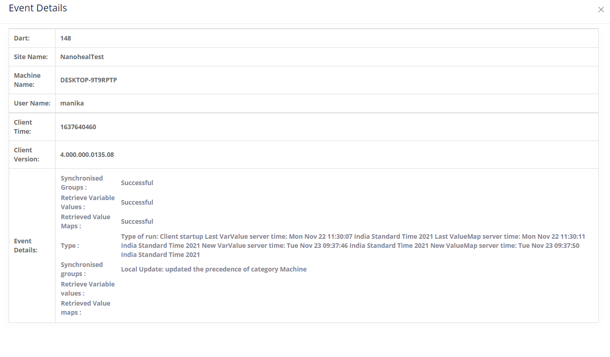
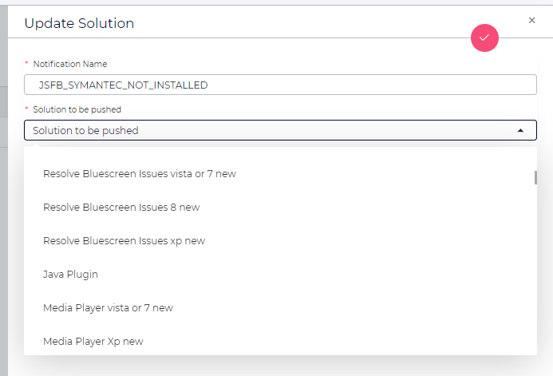

[Document on Notification]{.underline}

**Module Description**

-   Notification is used to filter out the events based on a specific
    condition and to provide a quick fix for the created notifications.

**Dashboard URL :**
[https://alex.nanoheal.com/Dashboard/notification/notification.php](https://qa.nanoheal.com/Dashboard/notification/notification.php)

**Files Involved**

**HTML**

-   Dashboard/notification/notification.php

-   Dashboard/notification/notification_html.php

**JavaScript**

-   Dashboard/js/notification/notify.js

**PHP**

-   Dashboard/notification/notification_func.php

-   Dashboard/lib/l-dashboard.php

**Notification Features**

-   Add/View/Edit Notification Notes

-   Action

-   Export to Excel

-   Update Solution

**Databases & Tables Involved**

  --------------- -----------------------------------------------------------------------------
  <table>
<colgroup>
<col style="width: 27%" />
<col style="width: 72%" />
</colgroup>
<tbody>
<tr class="odd">
<td><strong>Database</strong></td>
<td>event,core,dashboard</td>
</tr>
<tr class="even">
<td><strong>Tables</strong></td>
<td>event.Notifications,event.Console,core.NotifDefinations,dashboard.notifySol</td>
</tr>
</tbody>
</table>

  --------------- -----------------------------------------------------------------------------

**Functionalities Involved**

**To render data in the UI Table Grid**

  <table>
<colgroup>
<col style="width: 27%" />
<col style="width: 72%" />
</colgroup>
<tbody>
<tr class="odd">
<td><strong>1# Function Details</strong></td>
<td>Notification Data – left side pane</td>
</tr>
<tr class="even">
<td>JavaScript/Ajax Call</td>
<td>js/notification/notify.js
notification_datatable()
</td>
</tr>
</tr>
<tr class="odd">
<td>Request Method</td>
<td>POST</td>
</tr>
</tr>
<tr class="even">
<td>Parameters</td>
<td>{"function": 'get_notifications', 'token': token}</td>
</tr>
</tr>
<tr class="odd">
<td>PHP Route</td>
<td>notification/notification_func.php
'get_notifications' => 'get_notifications'</td>
</tr>
</tr>
<tr class="even">
<td>Response</td>
<td>Returns Notification list.</td>
</tr>
</tr>
<tr class="odd">
<td>Tables</td>
<td>event.Notifications,event.Console</td>
</tr>
</tr>
<tr class="even">
<td>Dependency</td>
<td>MYSQL</td>
</tr>
</tbody>
</table>

--------------------------------

  <table>
<colgroup>
<col style="width: 27%" />
<col style="width: 72%" />
</colgroup>
<tbody>
<tr class="odd">
<td><strong>2# Function Details</strong></td>
<td>Notification Grid data</td>
</tr>
<tr class="even">
<td>JavaScript/Ajax Call</td>
<td>js/notification/notify.js
notificationDtl_datatable()</td>
</tr>
</tr>
<tr class="odd">
<td>Request Method</td>
<td>POST</td>
</tr>
</tr>
<tr class="even">
<td>Parameters</td>
<td>{"function": 'get_notificationDtl', 'name': name, 'token': token}</td>
</tr>
</tr>
<tr class="odd">
<td>PHP Route</td>
<td>notification/notification_func.php
'get_notificationDtl' => 'get_notificationDtl'</td>
</tr>
</tr>
<tr class="even">
<td>Response</td>
<td>Returns Notification Grid data based on left pane selection.</td>
</tr>
</tr>
<tr class="odd">
<td>Tables</td>
<td>event.Notifications,event.Console</td>
</tr>
</tr>
<tr class="even">
<td>Dependency</td>
<td>MYSQL</td>
</tr>
</tbody>
</table>

---------------------------------------

To Add a note for the notification, Select the notification and click on
the ADD link to add a new notification, once added a note, one can
edit/view it.

  <table>
<colgroup>
<col style="width: 27%" />
<col style="width: 72%" />
</colgroup>
<tbody>
<tr class="odd">
<td><strong>3# Function Details</strong></td>
<td>To get the note added.</td>
</tr>
<tr class="even">
<td>JavaScript/Ajax Call</td>
<td>js/notification/notify.js
addNotes()</td>
</tr>
</tr>
<tr class="odd">
<td>Request Method</td>
<td>POST</td>
</tr>
</tr>
<tr class="even">
<td>Parameters</td>
<td>{"function": 'getNotes','name': tname,'site': site,
'eventDt': eventTime,'machine': machine,'token': token}
</td>
</tr>
</tr>
<tr class="odd">
<td>PHP Route</td>
<td>notification/notification_func.php
'getNotes' => 'getNotes'</td>
</tr>
</tr>
<tr class="even">
<td>Response</td>
<td>Note added for the respective notifications.</td>
</tr>
</tr>
<tr class="odd">
<td>Tables</td>
<td>event.Notifications,event.Console</td>
</tr>
</tr>
<tr class="even">
<td>Dependency</td>
<td>MYSQL</td>
</tr>
</tbody>
</table>

----------------

  <table>
<colgroup>
<col style="width: 27%" />
<col style="width: 72%" />
</colgroup>
<tbody>
<tr class="odd">
<td><strong>4# Function Details</strong></td>
<td>To update the notification notes</td>
</tr>
<tr class="even">
<td>JavaScript/Ajax Call</td>
<td>js/notification/notify.js
addNoteByName()</td>
</tr>
</tr>
<tr class="odd">
<td>Request Method</td>
<td>POST</td>
</tr>
</tr>
<tr class="even">
<td>Parameters</td>
<td>{"function": 'updateNote','name': name,'site': site,
'eventDt': eventTime,'machine': machine,'token': token}
</td>
</tr>
</tr>
<tr class="odd">
<td>PHP Route</td>
<td>notification/notification_func.php
'updateNote' => 'updateNote'</td>
</tr>
</tr>
<tr class="even">
<td>Response</td>
<td>Note updated successfully</td>
</tr>
</tr>
<tr class="odd">
<td>Tables</td>
<td>event.Notifications,event.Console</td>
</tr>
</tr>
<tr class="even">
<td>Dependency</td>
<td>MYSQL</td>
</tr>
</tbody>
</table>  

-------------------------------

ACTION - to apply fix to the notifications

  <table>
<colgroup>
<col style="width: 27%" />
<col style="width: 72%" />
</colgroup>
<tbody>
<tr class="odd">
<td><strong>5# Function Details</strong></td>
<td>To apply fix for the notification</td>
</tr>
<tr class="even">
<td>JavaScript/Ajax Call</td>
<td>js/notification/notify.js
notifyFix()</td>
</tr>
</tr>
<tr class="odd">
<td>Request Method</td>
<td>POST</td>
</tr>
</tr>
<tr class="even">
<td>Parameters</td>
<td>{function: 'get_notificationSoln', nid: name, token: token}</td>
</tr>
</tr>
<tr class="odd">
<td>PHP Route</td>
<td>notification/notification_func.php
'get_notificationSoln' => 'get_notificationSoln'</td>
</tr>
</tr>
<tr class="even">
<td>Response</td>
<td>Returns the suggested fix</td>
</tr>
</tr>
<tr class="odd">
<td>Tables</td>
<td>dashboard.notifySol</td>
</tr>
</tr>
<tr class="even">
<td>Dependency</td>
<td>-</td>
</tr>
</tbody>
</table>  

-------------------------------------

Details - This will help the user with the notification specific
details.

  <table>
<colgroup>
<col style="width: 27%" />
<col style="width: 72%" />
</colgroup>
<tbody>
<tr class="odd">
<td><strong>5# Function Details</strong></td>
<td>To get the notification event details</td>
</tr>
<tr class="even">
<td>JavaScript/Ajax Call</td>
<td>js/notification/notify.js
getDetails()</td>
</tr>
</tr>
<tr class="odd">
<td>Request Method</td>
<td>POST</td>
</tr>
</tr>
<tr class="even">
<td>Parameters</td>
<td>{"function": 'get_notificationsEvents', 'machine': machines, 'eventDt': eventTime,'name': name,'site': site,'token': token}</td>
</tr>
</tr>
<tr class="odd">
<td>PHP Route</td>
<td>notification/notification_func.php
'get_notificationsEvents' => 'get_notificationsEvents'</td>
</tr>
</tr>
<tr class="even">
<td>Response</td>
<td>Get event details of the notification</td>
</tr>
</tr>
<tr class="odd">
<td>Tables</td>
<td>EL notification index</td>
</tr>
</tr>
<tr class="even">
<td>Dependency if any</td>
<td>EL</td>
</tr>
</tbody>
</table>  

--------------------------------------

The Notification Details has a drilldown option. It has two button and
the functionality of both buttons are mentioned below:

1.  More Details - This will provide a detailed view of the Notification
    Event populated from the event.Console table.

2.  Show Nearby Events - This will provide the event list in the date
    range selected by the user.

----------------------------------------------------------------

1.  **MORE DETAILS :**

  <table>
<colgroup>
<col style="width: 27%" />
<col style="width: 72%" />
</colgroup>
<tbody>
<tr class="odd">
<td><strong>5# Function Details</strong></td>
<td>To view the Selected notification event details</td>
</tr>
<tr class="even">
<td>JavaScript/Ajax Call</td>
<td>js/notification/notify.js
showMoreDetails()</td>
</tr>
</tr>
<tr class="odd">
<td>Request Method</td>
<td>POST</td>
</tr>
</tr>
<tr class="even">
<td>Parameters</td>
<td>{ function: showEventDetails, eventId: event,csrfMagicToken: csrfMagicToken }</td>
</tr>
</tr>
<tr class="odd">
<td>PHP Route</td>
<td>notification/notification_func.php
'showEventDetails' => 'showEventDetails'</td>
</tr>
</tr>
<tr class="even">
<td>Response</td>
<td>Shows the details of the selected Notification</td>
</tr>
</tr>
</tbody>
</table>  

------------------------------------

2.  **SHOW NEARBY EVENTS:**

    

    This will show all the events from event.Events table based on the
    Device selection and the daterange selected.

  <table>
<colgroup>
<col style="width: 27%" />
<col style="width: 72%" />
</colgroup>
<tbody>
<tr class="odd">
<td><strong>6# Function Details</strong></td>
<td>To export the notification data</td>
</tr>
<tr class="even">
<td>JavaScript/Ajax Call</td>
<td>js/notification/notify.js
showNearbyEvents()</td>
</tr>
</tr>
<tr class="odd">
<td>Request Method</td>
<td>POST</td>
</tr>
</tr>
<tr class="even">
<td>Parameters</td>
<td>{"function": 'showNearbyEvents', 'machine': machineName, 'startDate ': startDate,'endDate ': endDate,''csrfMagicToken'': 'csrfMagicToken'}</td>
</tr>
</tr>
<tr class="odd">
<td>PHP Route</td>
<td>notification/notification_func.php
'showNearbyEvents' => 'showNearbyEvents'</td>
</tr>
</tr>
<tr class="even">
<td>Response</td>
<td>Return the list of events</td>
</tr>
</tr>
<tr class="odd">
<td>Tables</td>
<td>Event.Events</td>
</tr>
</tbody>
</table>  

-------------------------------

**Export To Excel**

  <table>
<colgroup>
<col style="width: 27%" />
<col style="width: 72%" />
</colgroup>
<tbody>
<tr class="odd">
<td><strong>7# Function Details</strong></td>
<td>To export the notification data</td>
</tr>
<tr class="even">
<td>JavaScript/Ajax Call</td>
<td>js/notification/notify.js
export_notification()</td>
</tr>
</tr>
<tr class="odd">
<td>Request Method</td>
<td>POST</td>
</tr>
</tr>
<tr class="even">
<td>Parameters</td>
<td>{"function": ''exportNotificationselected'', 'name': name, 'token ': token}</td>
</tr>
</tr>
<tr class="odd">
<td>PHP Route</td>
<td>notification/notification_func.php
'exportNotificationselected' => 'exportNotificationselected'</td>
</tr>
</tr>
<tr class="even">
<td>Response</td>
<td>Notifications Data exported successfully</td>
</tr>
</tr>
<tr class="odd">
<td>Tables</td>
<td>event.Notifications,event.Console</td>
</tr>
<tr class="even">
<td>Dependency if any</td>
<td>MYSQL</td>
</tr>
</tbody>
</table>  

------------------------------------

**Update Solution**

  <table>
<colgroup>
<col style="width: 27%" />
<col style="width: 72%" />
</colgroup>
<tbody>
<tr class="odd">
<td><strong>8# Function Details</strong></td>
<td>To update the notification based on the solution added.</td>
</tr>
<tr class="even">
<td>JavaScript/Ajax Call</td>
<td>
js/notification/notify.js
updateSolution()

	notifyOthersFix()

	notifyVarValue()
</td>
</tr>
</tr>
<tr class="odd">
<td>Request Method</td>
<td>POST</td>
</tr>
</tr>
<tr class="even">
<td>Parameters</td>
<td>
{"function": ''updateNocStatus'', 'machineDet': actionStr, 'name': selNid, 'token': token}

{"function": ''get_notificationSolnDtl'', 'notifyArr': sclid,'token': token}
</td>
</tr>
</tr>
<tr class="odd">
<td>PHP Route</td>
<td>notification/notification_func.php
'updateNocStatus' => 'updateNocStatus'</td>
</tr>
</tr>
<tr class="even">
<td>Response</td>
<td>Updates the status in EL. 
Returns: Done/Fail
</td>
</tr>
</tr>
<tr class="odd">
<td>Tables</td>
<td>EL notification index</td>
</tr>
<tr class="even">
<td>Dependency if any</td>
<td>EL</td>
</tr>
</tbody>
</table>  

------------------------------------

Front end and Back end are separately handled here. ID / Class mapping
needs to be done accordingly.
