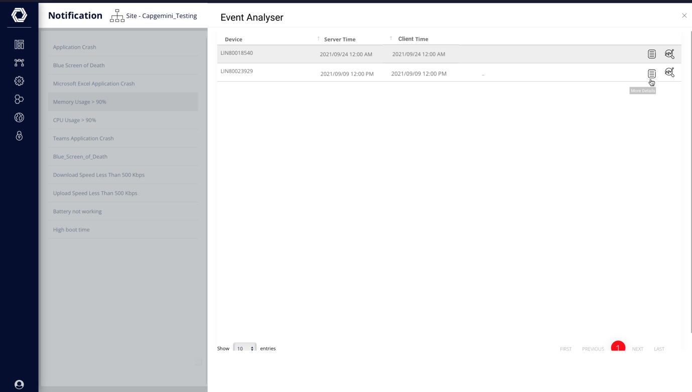
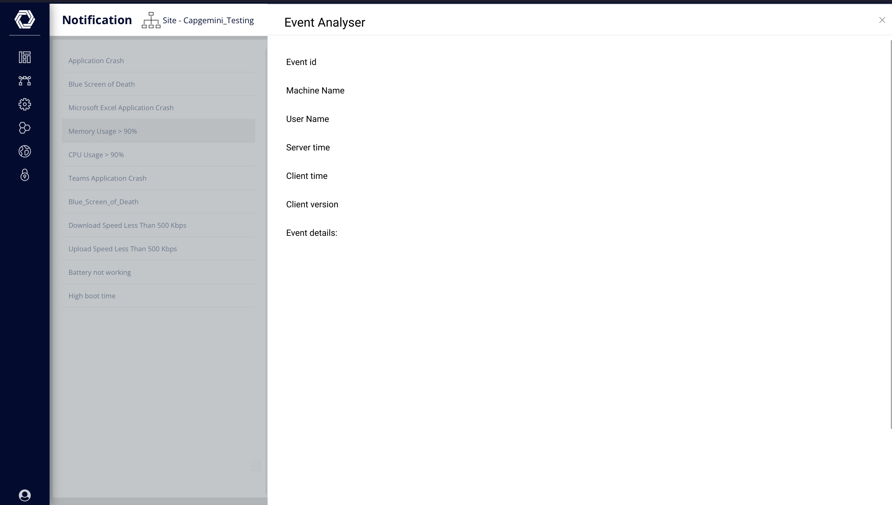
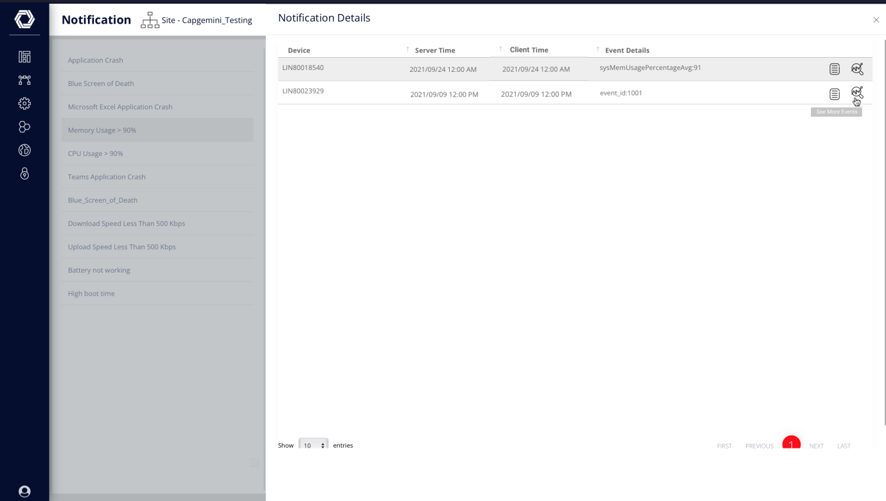
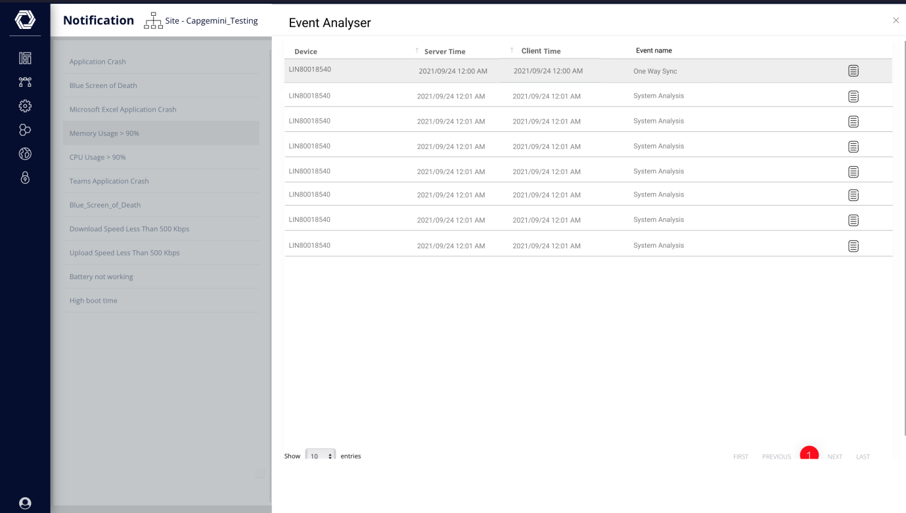

Notification details: List of Events that had contributed to create the
notification. This can be viewed only one notification at a time.

Show More events:

When someone clicks on 'Show more events;, show a table with **ALL** the
events that have come from the device in a 30 min Range (Event server
time -- 15 Min to Event server time + 15 Mins) --

E.g.: if the event Server time is 3:17 PM, show all the events that have
been reported from the device between 3:02 PM AND 3:32 PM. The screen is
as shown below:

A user can click on more details and see the specific information for
each event .

Pick the event details from Core.Definitions table. The table may look
like this:

  ------------- ------------- --------------------------- ----------------
  <table>
<colgroup>
<col style="width: 27%" />
<col style="width: 72%" />
</colgroup>
<tbody>
<tr class="even">
<td>Dart Number</td>
<td>Dart Name</td>
<td>Data ID</td>
<td>Short Description</td>
</tr>
<tr class="odd">
<td>310</td>
<td>Personal analytics</td>
<td>Text1. monitEndTime</td>
<td>Monitoring end time</td>
</tr>
<tr class="even">
<td>310</td>
<td>Personal analytics</td>
<td>Text3.processName</td>
<td>Process Name</td>
</tr>
</tbody>
</table>   

  ------------- ------------- --------------------------- ----------------

We will also have to define the dart 286 Tile names here instead of
analytics.autoheal table

Changes Made By Manika:

1.  Created a new table core.NotifDefinations (This needs to be updated
    with all text1,text2,text3,text4,string1,string2 parameters of each
    dart)

    

2.  Changes in Reporting code - Add Event id parameter in the previous
    flow.

    File Name - main/lib/l-ccrt.php

3.  Add new column in event.Console table at the end

\`eventDetails\` **LONGTEXT**

Query : ALTER TABLE event.Console ADD eventDetails LONGTEXT NULL;
