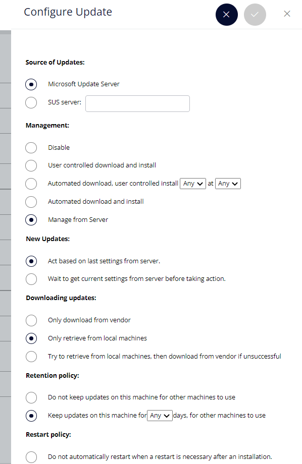
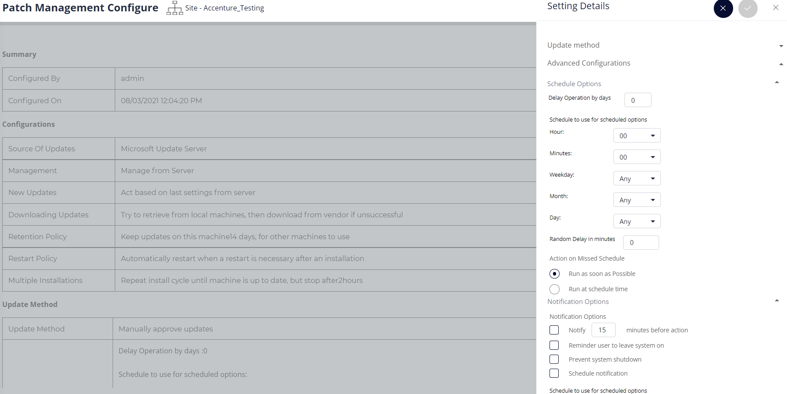

# PATCH MANAGEMENT
```
UI File : Dashboard/mum/mum_html.php

JS File : Dashboard/js/mum/patchmanagement.js
```
The Patch Management module Is divided into following modules:

1.  Patch Management - Agent Workspace-\>Patch Management

2.  Patch Management Configure - Management-\>Services-\>Patch
    Management Configure

**Patch Management Configure - Management-\>Services-\>Patch Management
Configure**
```
The module has following components:

1.  Configure Update

2.  Update Method
```
---------------
1.  CONFIGURE UPDATE

  ------------- -----------------------------------------------------------------------------------------------------------------------------------------
  <table>
<colgroup>
<col style="width: 27%" />
<col style="width: 72%" />
</colgroup>
<tbody>
<tr class="even">
<td>JS Function</td>
<td><p>Dashboard/js/mum/patchmanagement.js/ConfigUpdateSubmit</p>
</tr>
<tr class="odd">
<td>PHP/API Call</td>
<td>Dashboard/mum/mumfunctions.php/configureMUM</td>
</tr>
<tr class="even">
<td>Type</td>
<td>POST</td>
</tr>
<tr class="odd">
<td>Conditions required to satisfy the call</td>
<td><p>susselurl,managementSel,showDay,showHour,selUpdate,patchSource,</p>
<p>selDownUpdate,RetenSel,showDays2,restartSel,multipleInstallSel,showHour2</p></td>
</tr>
<tr class="even">
<td>Success Response</td>
<td>Conigurations Updated Successfully</td>
</tr>
<tr class="odd">
<td>Failure Response</td>
<td>Failed to add configuration. Please try again</td>
</tr>
</tbody>
</table>    

  ------------- -----------------------------------------------------------------------------------------------------------------------------------------



2.  UPDATE METHOD



Clicking on Settings will open the slider with two options:

-   Update Method

1.  All updates approved automatically

2.  Manually approve updates

-   Advanced Configurations

1.  Schedule Options

    The Schedule Options require the following information to be filled:

    1\. Schedule to use for scheduled options

    Hour,Minutes,Weekday,Month,Day

    2\. Random Delay in minutes

    3\. Action on Missed Schedule

    4\. Run as soon as Possible

    5\. Run at schedule time

2.  Notification Options

    The Notification Options require the following information to be
    filled:

    1\. Notify minutes before action

    2\. Reminder user to leave system on

    3\. Prevent system shutdown

    4\. Schedule notification

    5\. Schedule to use for scheduled options

    Hour,Minutes,Weekday,Month,Day

    6\. Random Delay in minutes

    7\. Action on Missed Schedule

    8\. Run as soon as Possible

    9\. Run at schedule time

------------ 
<table>
<colgroup>
<col style="width: 27%" />
<col style="width: 72%" />
</colgroup>
<tbody>
<tr class="even">
<td>JS Function</td>
<td><p>Dashboard/js/mum/patchmanagement.js/updatePatchmethod('settingsubmit')</p>
</tr>
<tr class="odd">
<td>PHP/API Call</td>
<td>Dashboard/mum/mumfunctions.php/mum_updatemethod</td>
</tr>
<tr class="even">
<td>Type</td>
<td>POST</td>
</tr>
<tr class="odd">
<td>Conditions required to satisfy the call</td>
<td><p>token,updatemethod,sdelayoper,schedlemin,
schedlehour,schedleday,schedlweek,schedlemon,scheduledelay,scheduleaction,notifmin,notifhour,</p>
<p>notifweek,notifmon,notifday,notirdelay,notiaction,notif_text ,notifymins,notifremnd,
notifprevsys,notifschdlsop,apprpgroupid,type,window</p></td>
</tr>
<tr class="even">
<td>Success Response</td>
<td>Settings have been updated successfully</td>
</tr>
<tr class="odd">
<td>Failure Response</td>
<td>Failed to add configuration. Please try again</td>
</tr>
</tbody>
</table>    

  --------------- ------------------------ ----------------------------------------------------------------------------------------------------------
  <table>
<colgroup>
<col style="width: 27%" />
<col style="width: 72%" />
</colgroup>
<tbody>
<tr class="even">
<td>Type</td>
<td>Database.Table</td>
<td>Columns</td>
</tr>
<tr class="odd">
<td>Fetch Data</td>
<td>core.MachineGroups</td>
<td>mgroupid</td>
</tr>
<tr class="even">
<td>Update</td>
<td>softinst.WUConfig</td>
<td>serverurl,management,installday,installhour,newpatches,propagate,updatecache,cacheseconds,restart,chain, chainseconds</td>
</tr>
<tr class="odd">
<td>Fetch </td>
<td>softinst.PatchStatus</td>
<td>patchid</td>
</tr>
<tr class="even">
<td>update</td>
<td>softinst.PatchGroupMap</td>
<td></td>
</tr>
<tr class="odd">
<td>Insert/Update</td>
<td>softinst.PatchConfig</td>
<td><p>installation,preventshutdown, reminduser,configtype, scheddelay,schedminute, schedhour, schedday, schedmonth, schedweek,schedrandom, schedtype, notifydelay, notifyminute, notifyhour,</p>
<p>notifyday, notifymonth, notifyweek, notifyrandom, notifytype,notifyfail, notifyadvance, notifyschedule, notifyadvancetime, notifytext,lastupdate,mgroupid, pgroupid</p></td>
</tr>
</tbody>
</table>

  --------------- ------------------------ ----------------------------------------------------------------------------------------------------------

**Patch Management - Agent Workspace-\>Patch Management**

The table will show all the patches available for the level .

  -------------------------- --------------------------------------------
  <table>
<colgroup>
<col style="width: 27%" />
<col style="width: 72%" />
</colgroup>
<tbody>
<tr class="even">
<td>JS Function</td>
<td><p>mum_patchlistData</p>
</tr>
<tr class="odd">
<td>PHP/API Call</td>
<td>get_allpatchData</td>
</tr>
<tr class="even">
<td>Type</td>
<td>POST</td>
</tr>
<tr class="odd">
<td>Conditions required to satisfy the call</td>
<td>Token</td>
</tr>
<tr class="even">
<td>Success Response</td>
<td>Display the list of Patches on the Level</td>
</tr>
<tr class="odd">
<td>Failure Response</td>
<td>Empty List </td>
</tr>
</tbody>
</table>    

  -------------------------- --------------------------------------------

  ---------------- ----------------------------- ------------------------
<table>
<colgroup>
<col style="width: 27%" />
<col style="width: 72%" />
</colgroup>
<tbody>
<tr class="even">
<td>Type</td>
<td>Database.Table</td>
<td>Columns</td>
</tr>
<tr class="odd">
<td>Fetch Data</td>
<td>softinst.PatchGroups</td>
<td>pgroupid</td>
</tr>
<tr class="even">
<td>Fetch Data</td>
<td>softinst.Patches</td>
<td>patchids</td>
</tr>
<tr class="odd">
<td>Fetch Data </td>
<td>softinst.PatchGroupMap</td>
<td>patchid</td>
</tr>
</tbody>
</table>

  ---------------- ----------------------------- ------------------------

The module has the following components:

1.  Approve Patch

2.  Decline Patch

3.  Remove Patch

4.  Export

5.  Export Patch Details

---------------------

1.  APPROVE PATCH

    The patches can be approved by selecting the patch and clicking on
    the "Approve Patch" Option in the dropdown.

  -------------------------- --------------------------------------------

<table>
<colgroup>
<col style="width: 27%" />
<col style="width: 72%" />
</colgroup>
<tbody>
<tr class="even">
<td>JS Function</td>
<td><p>actionSelection(‘approve’)</p>
</tr>
<tr class="odd">
<td>PHP/API Call</td>
<td>Approvepatch</td>
</tr>
<tr class="even">
<td>Type</td>
<td>POST</td>
</tr>
<tr class="odd">
<td>Conditions required to satisfy the call</td>
<td>token,ptchid,pgroupid,page</td>
</tr>
<tr class="even">
<td>Success Response</td>
<td>Patch has been Approved succesfully. It will take sometime to update the status</td>
</tr>
<tr class="odd">
<td>Failure Response</td>
<td>Some error occurred. Please try again.</td>
</tr>
</tbody>
</table>  

  -------------------------- --------------------------------------------

  ---------------- ---------------------------- --------------------------
<table>
<colgroup>
<col style="width: 27%" />
<col style="width: 72%" />
</colgroup>
<tbody>
<tr class="even">
<td>Type</td>
<td>Database.Table</td>
<td>Columns</td>
</tr>
<tr class="odd">
<td>Fetch Data</td>
<td>softinst.PatchConfig</td>
<td>pgroupid</td>
</tr>
<tr class="even">
<td>Fetch Data</td>
<td>core.MachineGroups</td>
<td>mgroupid,mgroupuniq</td>
</tr>
<tr class="odd">
<td>Fetch Data </td>
<td>softinst.PatchGroups</td>
<td>pgroupid</td>
</tr>
<tr class="odd">
<td>Delete</td>
<td>softinst.PatchGroupMap</td>
<td>patchid</td>
</tr>
<tr class="odd">
<td>Insert</td>
<td>softinst.PatchGroupMap</td>
<td>Pgroupid,patchid</td>
</tr>
</tbody>
</table>

  ---------------- ---------------------------- --------------------------

2.  DECLINE PATCH

After selecting the package which needs to be declined, click on the
"Decline" Option, the package will be declined.

  -------------------------- --------------------------------------------
<table>
<colgroup>
<col style="width: 27%" />
<col style="width: 72%" />
</colgroup>
<tbody>
<tr class="even">
<td>JS Function</td>
<td><p>actionSelection('decline')</p>
</tr>
<tr class="odd">
<td>PHP/API Call</td>
<td>Declinepatch</td>
</tr>
<tr class="even">
<td>Type</td>
<td>POST</td>
</tr>
<tr class="odd">
<td>Conditions required to satisfy the call</td>
<td>Prgourpid,token</td>
</tr>
<tr class="even">
<td>Success Response</td>
<td>Patch has been Declined</td>
</tr>
<tr class="odd">
<td>Failure Response</td>
<td>Failed</td>
</tr>
</tbody>
</table>  

  -------------------------- --------------------------------------------
<table>
<colgroup>
<col style="width: 27%" />
<col style="width: 72%" />
</colgroup>
<tbody>
<tr class="even">
<td>Type</td>
<td>Database.Table</td>
<td>Columns</td>
</tr>
<tr class="odd">
<td>Fetch Data</td>
<td>core.MachineGroups</td>
<td>mgroupid,mgroupuniq</td>
</tr>
<tr class="even">
<td>Fetch Data</td>
<td>softinst.PatchGroups</td>
<td>pgroupid</td>
</tr>
<tr class="odd">
<td>Fetch Data </td>
<td>softinst.PatchConfig</td>
<td>pgroupid</td>
</tr>
<tr class="odd">
<td>Insert/Update</td>
<td>softinst.PatchConfig</td>
<td>mgroupid,pgroupid,lastupdate,installation = 1,preventshutdown = 0,
reminduser=0,configtype=0,scheddelay = 0,schedminute = 60,schedhour = 24,schedday=0,schedmonth=0,schedweek = 7,schedrandom = 0,schedtype =2,notifydelay=0,notifyminute=60,notifyhour=24,notifyday = 0,notifymonth = 0,notifyweek = 7,notifyrandom = 0,notifytype = 1,notifyfail = 0,
notifyadvance = 0,notifyschedule = 0,notifyadvancetime = 900,notifytext = '',wpgroupid
</td>
</tr>
</tbody>
</table>

--------------------------------------

3.  REMOVE PATCH

  -------------------------- --------------------------------------------
<table>
<colgroup>
<col style="width: 27%" />
<col style="width: 72%" />
</colgroup>
<tbody>
<tr class="even">
<td>JS Function</td>
<td><p>removeCancel</p>
</tr>
<tr class="odd">
<td>PHP/API Call</td>
<td>get_removepatchData</td>
</tr>
<tr class="even">
<td>Type</td>
<td>POST</td>
</tr>
<tr class="odd">
<td>Conditions required to satisfy the call</td>
<td>token</td>
</tr>
<tr class="even">
<td>Success Response</td>
<td>Displays the list of removed patches with name ‘Wiz_REMV_PG’</td>
</tr>
</tbody>
</table>  

  -------------------------- --------------------------------------------

  ---------- ---------------------- --------------------------------------
<table>
<colgroup>
<col style="width: 27%" />
<col style="width: 72%" />
</colgroup>
<tbody>
<tr class="even">
<td>Type</td>
<td>Database.Table</td>
<td>Columns</td>
</tr>
<tr class="odd">
<td>Fetch Data</td>
<td>core.MachineGroups</td>
<td>mgroupid,mgroupuniq</td>
</tr>
<tr class="even">
<td>Fetch Data</td>
<td>softinst.PatchGroups</td>
<td>pgroupid</td>
</tr>
<tr class="odd">
<td>Fetch Data </td>
<td>softinst.PatchConfig</td>
<td>pgroupid</td>
</tr>
</tbody>
</table>

  ---------- ---------------------- --------------------------------------

After selecting a particular package click on "Remove Patch" , the patch
will be removed.

  -------------------------- --------------------------------------------
<table>
<colgroup>
<col style="width: 27%" />
<col style="width: 72%" />
</colgroup>
<tbody>
<tr class="even">
<td>JS Function</td>
<td><p>removePatch</p>
</tr>
<tr class="odd">
<td>PHP/API Call</td>
<td>Removepatch</td>
</tr>
<tr class="even">
<td>Type</td>
<td>POST</td>
</tr>
<tr class="odd">
<td>Conditions required to satisfy the call</td>
<td>Token,ptchid,pgroupid</td>
</tr>
<tr class="even">
<td>Success Response</td>
<td>Patch has been successfully removed</td>
</tr>
<tr class="odd">
<td>Failure Response</td>
<td>Some error occurred. Please try again.</td>
</tr>
</tbody>
</table>  

  -------------------------- --------------------------------------------

  ---------------- ----------------------------- ------------------------
<table>
<colgroup>
<col style="width: 27%" />
<col style="width: 72%" />
</colgroup>
<tbody>
<tr class="even">
<td>Type</td>
<td>Database.Table</td>
<td>Columns</td>
</tr>
<tr class="odd">
<td>Fetch Data</td>
<td>softinst.PatchGroups</td>
<td>pgroupid</td>
</tr>
<tr class="even">
<td>Fetch Data</td>
<td>softinst.Patches </td>
<td>patchid</td>
</tr>
<tr class="odd">
<td>Fetch Data </td>
<td>softinst.PatchGroupMap</td>
<td>patchid</td>
</tr>
</tbody>
</table>

  ---------------- ----------------------------- ------------------------

## EXPORT

The component allows user to export patches in a defined date range by
selecting the release date span,platform and patch type.

Then Click on the "Export" button.

--------------------------------------------

<table>
<colgroup>
<col style="width: 27%" />
<col style="width: 72%" />
</colgroup>
<tbody>
<tr class="even">
<td>JS Function</td>
<td><p>On click of id “exportsubmit”</p>
</tr>
<tr class="odd">
<td>PHP/API Call</td>
<td>mum_getfilterData</td>
</tr>
<tr class="even">
<td>Type</td>
<td>POST</td>
</tr>
<tr class="odd">
<td>Conditions required to satisfy the call</td>
<td>token,platform,patchtype,actionType,patchstatus,
from,to,leveltype
</td>
</tr>
<tr class="even">
<td>Success Response</td>
<td>Data Exported Successfully</td>
</tr>
<tr class="odd">
<td>Failure Response</td>
<td>No Data Avaialble</td>
</tr>
</tbody>
</table>  

  -------------- --------------------------------------------------------

<table>
<colgroup>
<col style="width: 27%" />
<col style="width: 72%" />
</colgroup>
<tbody>
<tr class="even">
<td>Type</td>
<td>Database.Table</td>
</tr>
<tr class="odd">
<td>Fetch Data</td>
<td>softinst.PatchStatus,core.Census,softinst.Patches</td>
</tr>
</tbody>
</table>

--------------------------------------
## EXPORT PATCH DETAILS

The list of the all the patches visible on the main grid will be
exported by clicking on the Export Patch Details Option.

  -------------------------- --------------------------------------------
 <table>
<colgroup>
<col style="width: 27%" />
<col style="width: 72%" />
</colgroup>
<tbody>
<tr class="even">
<td>JS Function</td>
<td><p>exportPatchData</p>
</tr>
<tr class="odd">
<td>PHP/API Call</td>
<td>Patch_ExportDetails</td>
</tr>
<tr class="even">
<td>Type</td>
<td>GET</td>
</tr>
<tr class="odd">
<td>Conditions required to satisfy the call</td>
<td>token</td>
</tr>
<tr class="even">
<td>Success Response</td>
<td>Patch Details Exported Successfully</td>
</tr>
<tr class="odd">
<td>Failure Response</td>
<td>Failed</td>
</tr>
</tbody>
</table>  

  -------------------------- --------------------------------------------

<table>
<colgroup>
<col style="width: 27%" />
<col style="width: 72%" />
</colgroup>
<tbody>
<tr class="even">
<td>Type</td>
<td>Database.Table</td>
<td>Columns</td>
</tr>
<tr class="odd">
<td>Fetch Data</td>
<td>softinst.PatchGroups</td>
<td>pgroupid</td>
</tr>
<tr class="even">
<td>Fetch Data</td>
<td>softinst.Patches </td>
<td>patchid</td>
</tr>
<tr class="odd">
<td>Fetch Data </td>
<td>softinst.PatchGroupMap</td>
<td>patchid</td>
</tr>
<tr class="even">
<td>Insert Data </td>
<td>core.AuditLog</td>
<td>module,action,username,userid,
useremail,url,method,ip,agent,status,
rawReference,refName,created
</td>
</tr>
</tbody>
</table>
