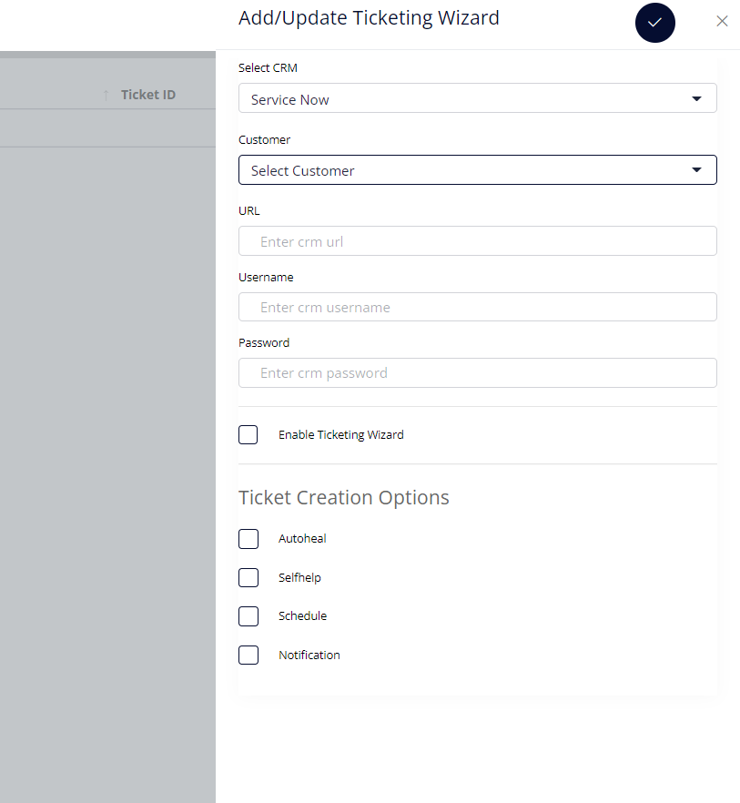

# SERVICE NOW

Path to Navigate in V10 -\> Integrations -\> Service Now

**Files included:**
```
Main File:

Dashboard/ticketingwizard/index.php


HTML Files:

Dashboard/ticketingwizard/ticketingwizard_html.php


PHP Files:

Dashboard/lib/l-ticketingwiz.php


JS Files:

Dashboard/js/customer/ticketingwizard.js


CRON File:

The CRON needs to be enabled for regular intervals to update tickets to
SN Instance
File Name: Dashboard/cron/c-crmincident.php
```

**Sample Instance:**
```
Instance name: dev83411

Instance URL: https://dev83411.service-now.com/

Username: admin

Password: gjZKZwso1X5N
```


**API Call for SN Instance**
```
$URL = $instanceApiUrl . "/api/now/table/incident";

$userpwd = "$crmUsername:$crmPassword";

$instanceData\['assignment_group'\] = 'Service Desk';

$instanceData\['companyName'\] = $companyName;

$instanceData\['company'\] = $companyName;

$instanceData\['category'\] = 'Software';

$instanceData\['subcategory'\] = 'Operating System';

$instanceData\['service_tag'\] = $machineName;

$instanceData\['state'\] = $ticketState;

$instanceData\['impact'\] = 1;

$instanceData\['urgency'\] = 1;

$instanceData\['priority'\] = ($ticketState == 7) ? 3 : 1;

$instanceData\['contact_type'\] = 'email';

$instanceData\['correlation_id'\] = 'Nano Heal Integrator';

$instanceData\['opened_by'\] = 'Nano Heal Integrator';

$instanceData\['machineName'\] = $machineName;

$instanceData\['short_description'\] = $ticketSub . " " . "Machine: " .
$machineName;

$instanceData\['description'\] = $ticketDescription;

$instanceData\['comments'\] = $ticketDescription;

if($ticketState == 7) {

      $instanceData\['close_code'\] = 'Closed/Resolved by Caller';

      $instanceData\['close_notes'\] = 'Closed Ticket';

}

Function Name : createTicketApi
```


**Service Now Features**

-   Configure

-   Action Details

-   Export

**Databases & Tables Involved**

|              |                                           |
|--------------|-------------------------------------------|
| **Database** | event                                     |
| **Tables**   | event.crmSnowConfigure,event.ticketEvents |

**1. Configure:**



The following values need to be provided to update the Service Now
instance Details to the DB.
```
1.  Customer/Site name

2.  CRM URL

3.  CRM Username

4.  CRM Password

5.  Enable Ticketing Wizard to enable/disable

6.  Ticket Creation Options


1.  Autoheal

2.  Selfhelp

3.  Schedule

4.  Automation
```
<table>
<colgroup>
<col style="width: 27%" />
<col style="width: 72%" />
</colgroup>
<tbody>
<tr class="odd">
<td><strong>Function Details</strong></td>
<td></td>
</tr>
<tr class="even">
<td>JavaScript/Ajax Call</td>
<td><p>js/customer/ticketingwizard.js</p>
<p>configureCRM()</p></td>
</tr>
<tr class="odd">
<td>Request Method</td>
<td>POST</td>
</tr>
<tr class="even">
<td>Parameters</td>
<td><p>{</p>
<p>'function': 'configureCRMDetails',</p>
<p>'crmtype': crmtype,</p>
<p>'customer': customer,</p>
<p>'crmurl': crmurl,</p>
<p>'crmusername': crmusername,</p>
<p>'crmpassword': btoa(crmpassword),</p>
<p>'tickEnable': tickEnable,</p>
<p>'tickAutoheal': tickAutoheal,</p>
<p>'tickSelfhelp': tickSelfhelp,</p>
<p>'tickSchedule': tickSchedule,</p>
<p>'tickNotification': tickNotification, 'csrfMagicToken':
csrfMagicToken</p>
<p>}</p></td>
</tr>
<tr class="odd">
<td>PHP Route</td>
<td><p>/lib/l-ticketingwiz.php</p>
<p>'configureCRMDetails' =&gt; 'configureCRMDetails'</p></td>
</tr>
<tr class="even">
<td>Response</td>
<td>CRM details has been configured successfully</td>
</tr>
<tr class="odd">
<td>Tables</td>
<td>Event.crmSnowConfigure</td>
</tr>
<tr class="even">
<td>Dependency</td>
<td>MYSQL</td>
</tr>
</tbody>
</table>