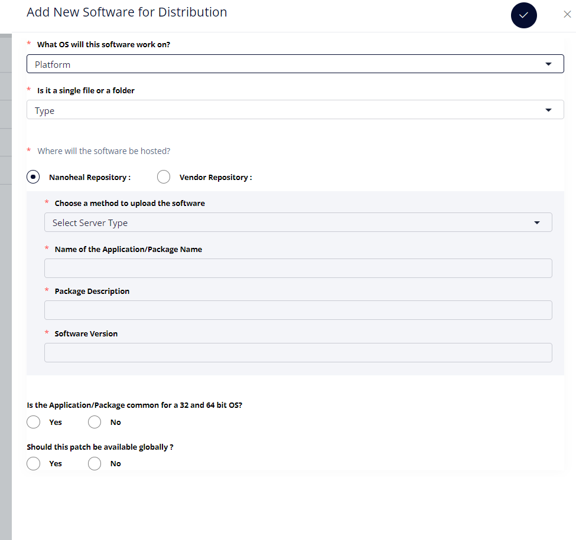
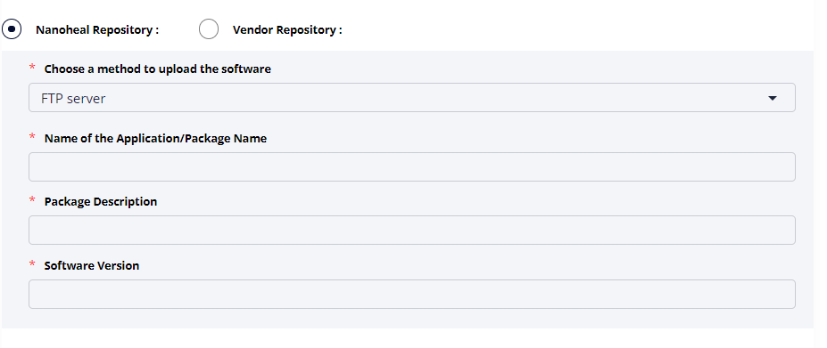
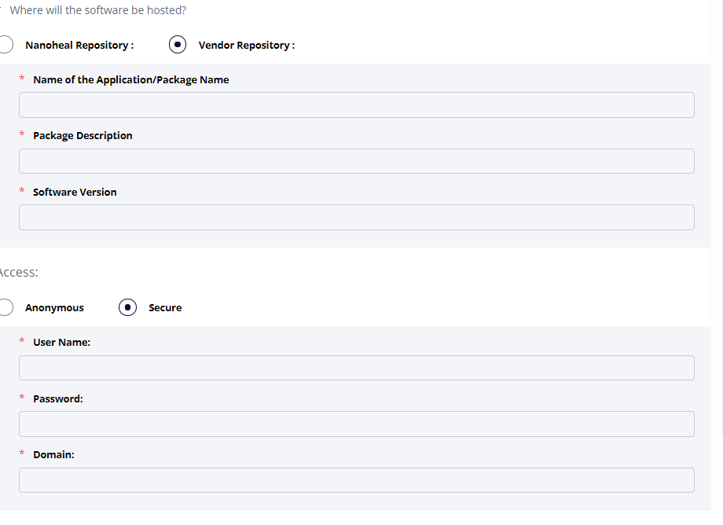
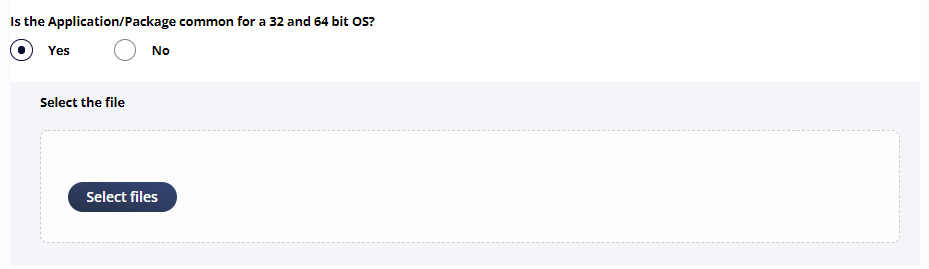
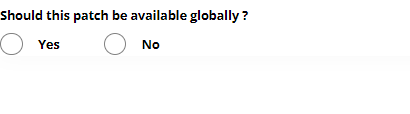
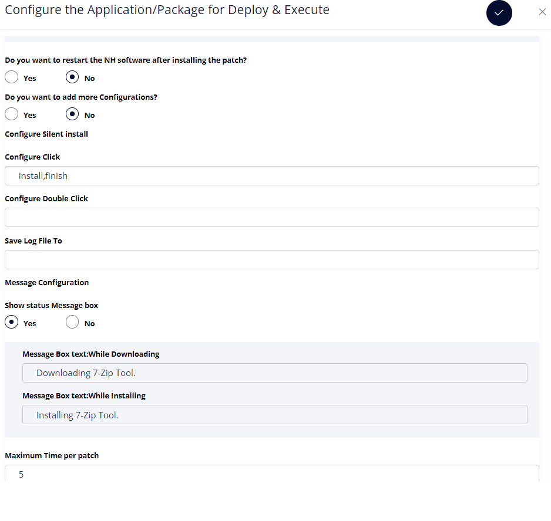
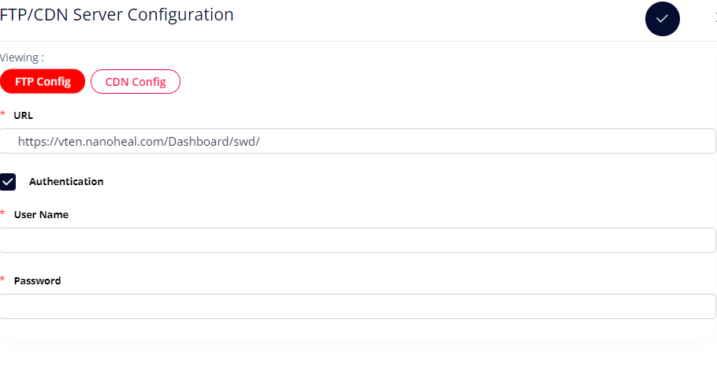
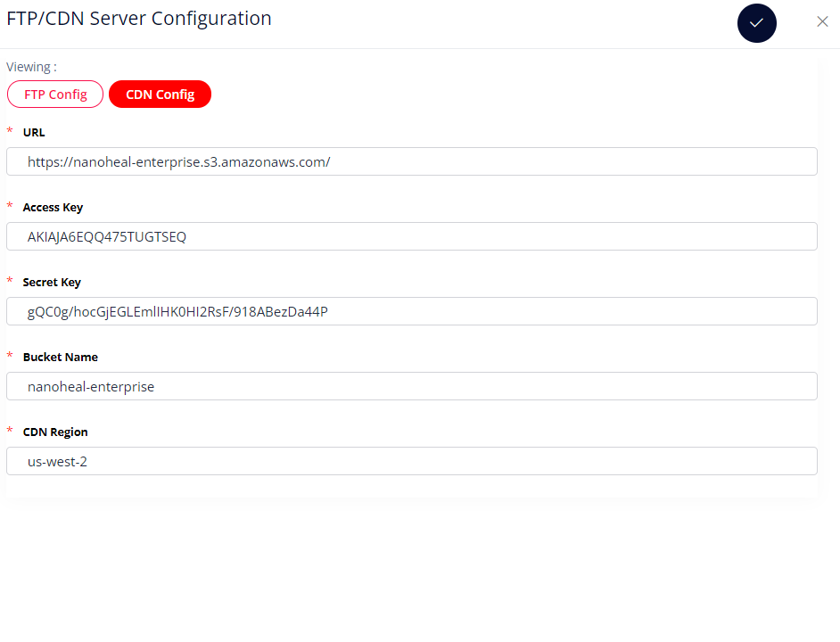

# SOFTWARE DISTRIBUTION

The SWD module is divided into two parts:

1.  Management-\>Services-\>Software Distribution

2.  Agent Workspace-\>Software Distribution Configuration


**Software Distribution : Management-\>Services-\>Software
Distribution**

This module have the following options:

The Module allows a software to be distributed on the Site/Machine/Group
Level. 

 
```
UI File : 

Dashboard/softdist/swd_list_html.php 

Dashboard/softdist/swd_audit_html 
```
 
```
JS File :  

Dashboard/js/softdist/addPackage.js 

Dashboard/js/softdist/editPackage.js 

Dashboard/js/softdist/softdistAudit.js 

Dashboard/js/softdist/softdistConfigure.js 

Dashboard/js/softdist/softdistData.js 
```

1.  Add a new software

2.  Configure Package

3.  Configure Upload

4.  Delete

-------------------------

1.  **ADD A NEW SOFTWARE**



-   Selection for OS will allow you to select the platform :
    Windows,Android,Linux,Mac,OS

-   Type of Upload- File or folder

-   Software hosting :

    Vendor Repository or Nanoheal Repository




Nanoheal Repository will allow to upload the exe on FTP location or
the CDN location along with the additional info :

1.  Name of Application/Package Name

2.  Package Description

3.  Software Version

If Vendor Repository is selected , then we have to access the vendor
repository by providing the access details like username and
password provided by the vendor.



Is the Application/Package common for a 32 and 64 bit OS?

An option to upload the exe files for 32-bit and 64-bit OS

If the exes are same for both 32 bit and 64 bit select yes else no



If both 32 and 64 bit exes are different:


To make the package global select yes else no



 <table>
<colgroup>
<col style="width: 27%" />
<col style="width: 72%" />
</colgroup>
<tbody>
<tr class="even">
<td>JS Function</td>
<td><p>Dashboard/js/softdist/addPackage.js/addPackageFunction </p>
</tr>
<tr class="odd">
<td>PHP/API Call</td>
<td>Dashboard/softdist/SavePackageDataInDB.php </td>
</tr>
<tr class="even">
<td>Type</td>
<td>POST </td>
</tr>
<tr class="odd">
<td>Conditions required to satisfy the call</td>
<td>Token,platform,type,sourcetype,source to upload,
package name,package description,softwareversion,precheckpath,global/nonglobal 
</td>
</tr>
<tr class="even">
<td>Success Response</td>
<td>Successfully added ftp configuration </td>
</tr>
<tr class="odd">
<td>Failure Response</td>
<td>Error in submitting Configuration </td>
</tr>
</tbody>
</table>

----------------------------

  <table>
<colgroup>
<col style="width: 27%" />
<col style="width: 72%" />
</colgroup>
<tbody>
<tr class="odd">
<td><strong>Tables :</strong></td>
<td></td>
</tr>
<tr class="even">
<td>Type</td>
<td>Database.Table</td>
<td>Columns</td>
</tr>
<tr class="odd">
<td>Fetch Data</td>
<td>softinst.Packages </td>
<td>All </td>
</tr>
<tr class="even">
<td>Insert Data </td>
<td>softinst.Packages </td>
<td>platform,type, sourceType,protocol,packageDesc, path, fileName,packageName, androidIcon, version, access, userName,password, domain, status, fileSize, global, owner, distrubute, distributionPath, user, lastModified,configDetail, ftpcdnURL </td>
</tr>
<tr class="odd">
<td>Insert Data </td>
<td>softinst.PackagesConfiguration </td>
<td>packageId, dcheckPreInstall, dValidationFilePath,dsoftwareName, dsoftwareVersion, dknowledgeBase, dservicePack, dRootKey, dSubKey $peerSqlA ,pExecPreCheckVal,pRegName,pType,pValue </td>
</tr>
</tbody>
</table>

2.  **CONFIGURE PACKAGE**

After adding the package details the package need to be configured
as per the requirement

 



Yesdhani can help with the configurations that needs to be updated here.

3.  **CONFIGURE UPLOAD**

Configure upload allows to upload the software on FTP server or CDN server

FTP Configuration 

The Following information need to be added: 

1.  FTP Url 

Example : https://demonew.nanoheal.com/dv8/swd/ 

2.  If Authentication is provided, provide Username and password.

  ------------------ ------------------------------------------------------
<table>
<colgroup>
<col style="width: 27%" />
<col style="width: 72%" />
</colgroup>
<tbody>
<tr class="even">
<td>JS Function</td>
<td><p>Dashboard/js/softdist/softdistConfigur.js/ftpConfig </p>
</tr>
<tr class="odd">
<td>PHP/API Call</td>
<td>Dashboard/softdist/SWD_Function.php/saveftpconfig </td>
</tr>
<tr class="even">
<td>Type</td>
<td>POST </td>
</tr>
<tr class="odd">
<td>Conditions required to satisfy the call</td>
<td>Token,ftpurl,username,password </td>
</tr>
<tr class="even">
<td>Success Response</td>
<td>Successfully added ftp configuration </td>
</tr>
<tr class="odd">
<td>Failure Response</td>
<td>Error in submitting Configuration </td>
</tr>
</tbody>
</table>

----------------------------
 

  <table>
<colgroup>
<col style="width: 27%" />
<col style="width: 72%" />
</colgroup>
<tbody>
<tr class="even">
<td>Type</td>
<td>Database.Table</td>
<td>Columns</td>
</tr>
<tr class="even">
<td>Insert Data </td>
<td>softinst.PackagesFtp </td>
<td>ftp, ftpUrl, ftpauth, ftpUser, ftpPwd, user </td>
</tr>
<tr class="odd">
<td>Insert Data </td>
<td>core.AuditLog </td>
<td>module,action,username,userid,useremail, 
url,method,ip,agent,status,rawReference,refName,created </td>
</tr>
</tbody>
</table>

-----------------------------



CDN SERVER CONFIGURATION:

The following information need to be added: 

1.  CDN URL 

2.  Access Key 

3.  Secret Key 

4.  Bucket Name 

5.  CDN Region 

  -------------- --------------------------------------------------------
<table>
<colgroup>
<col style="width: 27%" />
<col style="width: 72%" />
</colgroup>
<tbody>
<tr class="even">
<td>JS Function</td>
<td><p>Dashboard/js/softdist/softdistConfigure.js/cdnConfig  </p>
</tr>
<tr class="odd">
<td>PHP/API Call</td>
<td>Dashboard/softdist/SWD_Function.php/savecdnconfig </td>
</tr>
<tr class="even">
<td>Type</td>
<td>POST </td>
</tr>
<tr class="odd">
<td>Conditions required to satisfy the call</td>
<td>Token,cdnurl,accesskey,secretkey,bucketname,cdnregion </td>
</tr>
<tr class="even">
<td>Success Response</td>
<td>Successfully updated cdn configuration </td>
</tr>
<tr class="odd">
<td>Failure Response</td>
<td>Error in submitting Configuration </td>
</tr>
</tbody>
</table>

  -------------- --------------------------------------------------------

  <table>
<colgroup>
<col style="width: 27%" />
<col style="width: 72%" />
</colgroup>
<tbody>
<tr class="even">
<td>Type</td>
<td>Database.Table</td>
<td>Columns</td>
</tr>
<tr class="even">
<td>Insert Data </td>
<td>softinst.PackagesFtp </td>
<td>cdn,cdnUrl, cdnAccessKey, cdnSecretKey, cdnBucketName, cdnRegion, user </td>
</tr>
<tr class="odd">
<td>Insert Data </td>
<td>core.AuditLog </td>
<td>module,action,username,userid,useremail, 
url,method,ip,agent,status,rawReference,refName,created </td>
</tr>
</tbody>
</table>

---------------------------------




4.  **DELETE**

    Delete will allow to delete the selected software

    Select the package that need to be deleted and click on the "Delete"
    option in the dropdown. 

  ------------ ---------------------------------------------------------<table>
<colgroup>
<col style="width: 27%" />
<col style="width: 72%" />
</colgroup>
<tbody>
<tr class="even">
<td>JS Function</td>
<td><p>Dashboard/js/softdist/softdistData.js/confirmDelete </p>
</tr>
<tr class="odd">
<td>PHP/API Call</td>
<td>Dashboard/softdist/SWD_Function.php/deleteFn </td>
</tr>
<tr class="even">
<td>Type</td>
<td>POST </td>
</tr>
<tr class="odd">
<td>Conditions required to satisfy the call</td>
<td>Token,id  </td>
</tr>
<tr class="even">
<td>Success Response</td>
<td>Your package has been deleted </td>
</tr>
<tr class="odd">
<td>Failure Response</td>
<td>Please select a package to delete </td>
</tr>
</tbody>
</table>

----------------------------------

  <table>
<colgroup>
<col style="width: 27%" />
<col style="width: 72%" />
</colgroup>
<tbody>
<tr class="even">
<td>Type</td>
<td>Database.Table</td>
<td>Columns</td>
</tr>
<tr class="even">
<td>Delete Data </td>
<td>softinst.Packages  </td>
<td>id</td>
</tr>
</tbody>
</table>

-----------------------------

**Software Distribution : Agent Workspace-\> Software Distribution
Configuration**

This module allows to deploy/execute the SWD created in the previous
section.

1.  Deploy/Install

This component allows user to Distribute/Execute the package on Site/Machine/Group Level.

  ------------ ----------------------------------------------------------
<table>
<colgroup>
<col style="width: 27%" />
<col style="width: 72%" />
</colgroup>
<tbody>
<tr class="even">
<td>JS Function</td>
<td><p>On click of id “executeNow”  </p>
</tr>
<tr class="odd">
<td>PHP/API Call</td>
<td>Dashboard/softdist/SWD_Function.php/getConfigDistribute </td>
</tr>
<tr class="even">
<td>Type</td>
<td>POST </td>
</tr>
<tr class="odd">
<td>Conditions required to satisfy the call</td>
<td>Token,id  </td>
</tr>
<tr class="even">
<td>Success Response</td>
<td>Displays the configurations </td>
</tr>
<tr class="odd">
<td>Failure Response</td>
<td>Empty  </td>
</tr>
</tbody>
</table>


---------------------------


  <table>
<colgroup>
<col style="width: 27%" />
<col style="width: 72%" />
</colgroup>
<tbody>
<tr class="even">
<td>Type</td>
<td>Database.Table</td>
<td>Columns</td>
</tr>
<tr class="odd">
<td>Fetch Data </td>
<td>softinst.Packages  </td>
<td>configDetail </td>
</tr>
<tr class="even">
<td>Fetch Data </td>
<td>softinst.Packages  </td>
<td>platform,type, sourceType,protocol,packageDesc, path, fileName,packageName, androidIcon, version, access, userName,password, domain, status, fileSize, global, owner, distrubute, distributionPath, user, lastModified,configDetail, ftpcdnURL </td>
</tr>
<tr class="odd">
<td>Fetch Data </td>
<td>softinst.PackagesConfiguration </td>
<td>packageId, dcheckPreInstall, dValidationFilePath,dsoftwareName, dsoftwareVersion, dknowledgeBase, dservicePack, dRootKey, dSubKey $peerSqlA ,pExecPreCheckVal,pRegName,pType,pValue </td>
</tr>
</tbody>
</table>

-----------------------------

For Executing the configuration click on the Save button: 

<table>
<colgroup>
<col style="width: 27%" />
<col style="width: 72%" />
</colgroup>
<tbody>
<tr class="even">
<td>JS Function</td>
<td><p>Dashboard/js/softdist/softdistConfigure.js/ </p>
</tr>
<tr class="odd">
<td>PHP/API Call</td>
<td>Dashboard/softdist/SWD_Function.php/saveConfigFn </td>
</tr>
<tr class="even">
<td>Type</td>
<td>POST </td>
</tr>
<tr class="odd">
<td>Conditions required to satisfy the call</td>
<td>Token,edconfig: config, 
column: 'distributionConfigDetail', 
retryopt: retryOpt,id 
</td>
</tr>
<tr class="even">
<td>Success Response</td>
<td>Displays the configurations </td>
</tr>
<tr class="odd">
<td>Failure Response</td>
<td>Empty  </td>
</tr>
</tbody>
</table>

-------------------------------------

  <table>
<colgroup>
<col style="width: 27%" />
<col style="width: 72%" />
</colgroup>
<tbody>
<tr class="even">
<td>Type</td>
<td>Database.Table</td>
<td>Columns</td>
</tr>
<tr class="odd">
<td>Update Data </td>
<td>softinst.Packages  </td>
<td>configDetail,distrubute=1,isConfigured=2 </td>
</tr>
<tr class="even">
<td>Fetch </td>
<td>core.Census </td>
<td>host </td>
</tr>
<tr class="odd">
<td>Fetch </td>
<td>iosprofile.device </td>
<td>UDID </td>
</tr>
<tr class="even">
<td>Fetch </td>
<td>core.MachineGroups  </td>
<td>mgroupid </td>
</tr>
<tr class="odd">
<td>Fetch </td>
<td>core.MachineGroupMap  </td>
<td>site,host </td>
</tr>
<tr class="even">
<td>Insert  </td>
<td>iosprofile.mdmConfig </td>
<td>scope, machine, priority, dartNum, xml, executeTime, level, status </td>
</tr>
</tbody>
</table>

-----------------------------

2.  Export status

This is for exporting the status of SWD deployed/executed.

  ------------ ----------------------------------------------------------
 <table>
<colgroup>
<col style="width: 27%" />
<col style="width: 72%" />
</colgroup>
<tbody>
<tr class="even">
<td>JS Function</td>
<td><p>Dashboard/js/softdist/softdistAudit.js/ </p>
</tr>
<tr class="odd">
<td>PHP/API Call</td>
<td>Dashboard/softdist/SWD_Function.php/exportAuditFn</td>
</tr>
<tr class="even">
<td>Type</td>
<td>POST </td>
</tr>
<tr class="odd">
<td>Conditions required to satisfy the call</td>
<td>packageID,&packageName,csrfMagicToken</td>
</tr>
<tr class="even">
<td>Success Response</td>
<td>Data Exported Successfully</td>
</tr>
<tr class="odd">
<td>Failure Response</td>
<td>Empty  </td>
</tr>
</tbody>
</table>

  ------------ ----------------------------------------------------------
