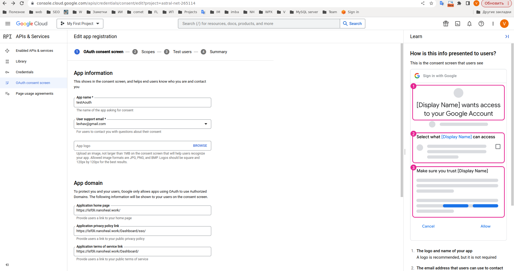
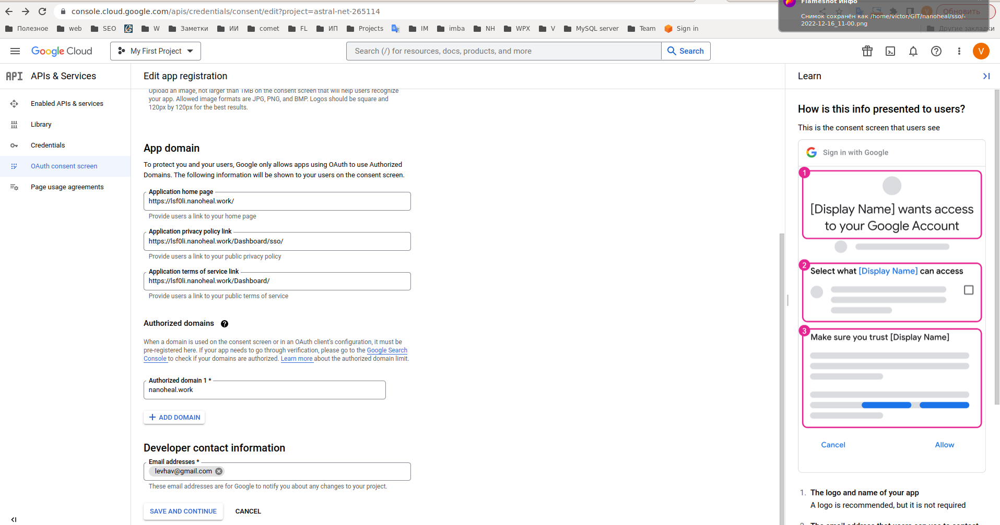

# OAUTH

## OAUTH CONFIG

The values for all fields you can get from you identity provider

For example for Google oauth you can use this:

- Auth URL: https://accounts.google.com/o/oauth2/auth

- Access Token URL: https://accounts.google.com/o/oauth2/token

- scope: “openid email“ (with a space separator)

- Client ID, Client Secret  and Resource URL  you can get in https://console.cloud.google.com/

- At first - create app here:

- Then you have to create keys

- Usefull additional information https://hmh.engineering/how-to-get-oauth-access-token-and-retrieve-data-from-google-apis-using-postman-9a95ffe030ae
