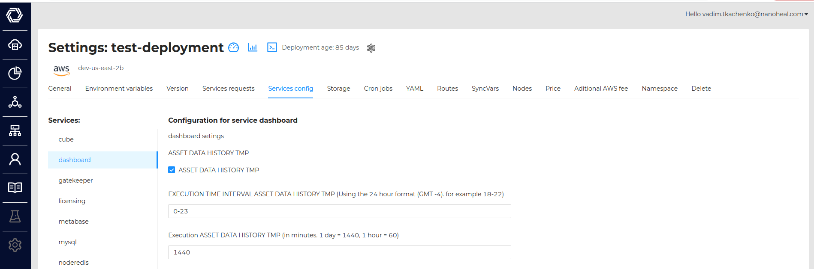
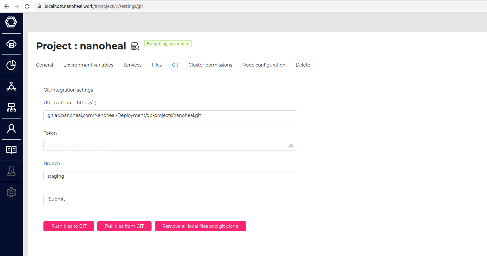

## Cron Configuration
To configure the cron, you need to perform the configuration in the UI

Now there are 3 types of settings for each dart :
- enable/disable
- the frequency of the launch. The time is indicated in minutes. If you specify 20,
 then the cron will run every 20 minutes.
- Time frame of execution in 24-hour format.If we specify 13-19, then cron will try to start from 13 to 19 hours.

As a result, we can turn on the cron, which will run every 20 minutes from 13 to 19 hours.
## INFORMATION ON CRON

variables ASSET DAYS , CENSUS DAYS, DELETE EVENTS SCRIP - Also set on this page

## Description of cron tasks

1) SQL DAILY

    This cron recreates the AssetDataDaily table and writes data from AssetData per day to it

2) LATEST COMBINED ASSET

    This cron recreates the LatestCombinedAsset table and writes data from AssetDataDaily
 where dataid = 16 or dataid = 5 or dataid = 20 or dataid = 39

3) ASSET DATA HISTORY TMP

      Writes data to the AssetDataHistoryTmp_A10 and AssetDataHistoryTmp_A16 tables from AssetData and Machine for one day.

4) NOTIFICATION TTL

    This cron clears the Console table. The storage time given is indicated via ENV

5)  NOT A36 DAILY

    This cron recreates table NotA36Daily_tmp

6) METABASE AGGREGATION

    This cron takes data from metabase and writes it to the database

    ENV for start cron:

           CHARTS_ID
           METABASE_SITE_URL
           METABASE_SECRET_KEY

7) C-CRMINCIDENT

    push tickets to serviceNow

8) C-PURGE

9) CLOSED EVENTS

    push info from tickets to serviceNow

10) EXPUNGE MACHINES

### After setting up cron, you need to update the configuration file that lies in GIT
To do this, go to the project settings in the GIT section.

First you need to click on the PULL button and then on PUSH

