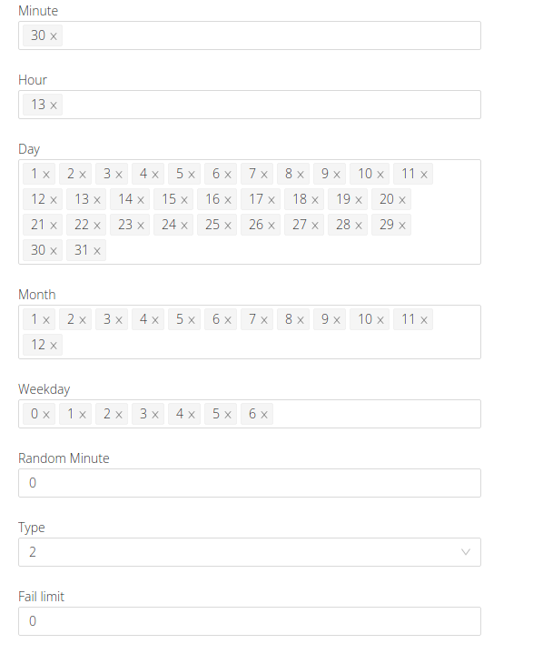
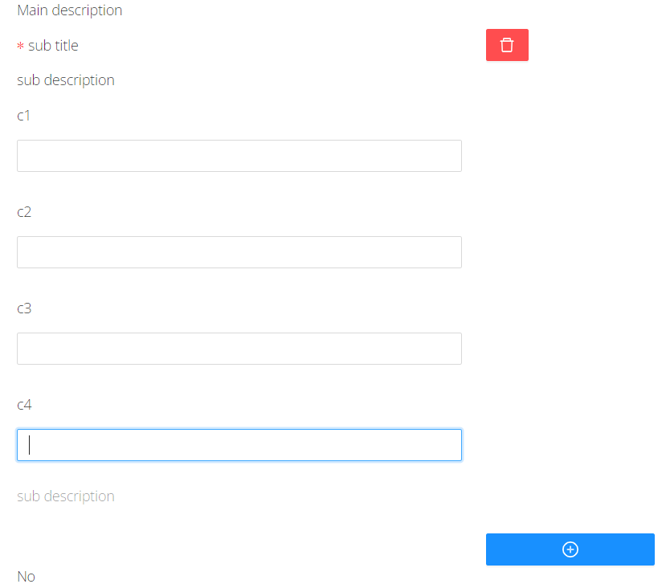

# In the UI of the dart settings, we can add custom fields.

- stringNoYes
- stringEnableDisable
- string01
- DartScheduleWidget
- CustomTableWidget

### 1. stringNoYes

If you specify a widget for a field in the UI scheme, then we will get a field that can take the value **yes** or **no** using the switch.

### 2. stringEnableDisable

If you specify a widget for a field in the UI scheme, then we will get a field that can take the value **enable** or **disable** using the switch.

### 3. string01

If you specify a widget for a field in the UI scheme, then we will get a field that can take the value **0** or **1** using the switch.

### 4. DartScheduleWidget

If you specify a widget for a field in the user interface schema, then we will get a set of components that allow you to configure a schedule for cron tasks.

### 5. CustomTableWidget

If you specify a widget for a field in the UI scheme, then we will get an element that allows you to form values like "1#NXT#263#..."

