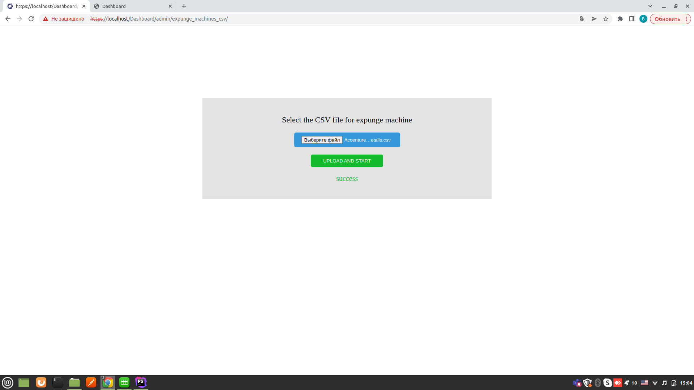

##EXPUNGE MACHINES USING A CSV FILE

to expunge machines, you need to go to the page https://XXX/Dashboard/admin/expunge_machines_csv/expunge.php

Select the file, and click on the "upload and start" button

The file will be processed and delete the machines that are specified in the file.
