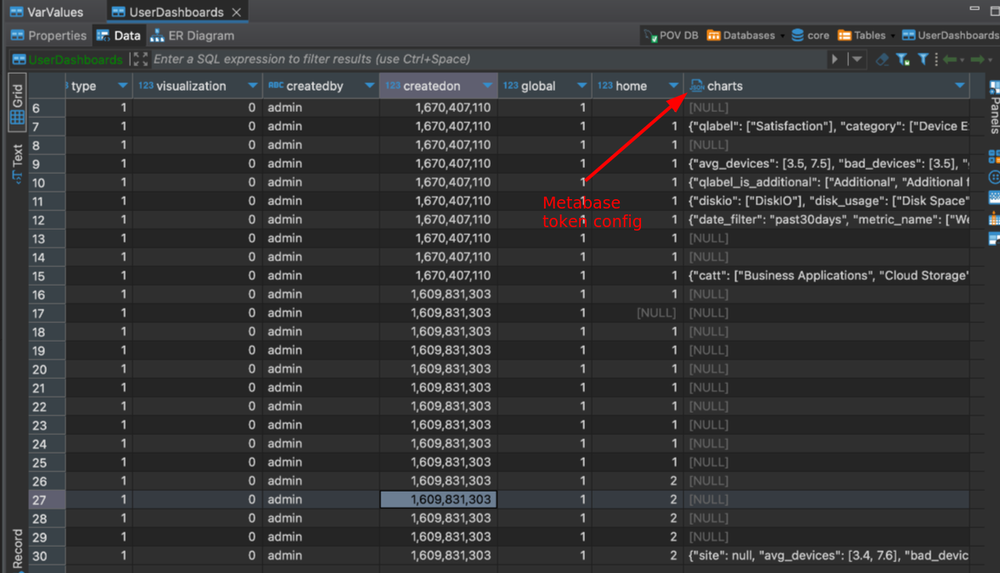

In core.UserDashboards we can add configuration for metabase dashboards



Here param "site":"session" - value session in any of params will be replaced with real value from site/group UI element. It`s needed to know where we have to add site selectors.

not all charts in metabase should use the value from the site's selector element.

Some of dashboards not use it.  Some of dashboards can have group param instead of site param.

You can use params like

```
"site":"session"
"group":"session"
"any-other-key":"session"
```

and in all ths cases value session will be replaced to the selected site name from user php-session from this UI element:


