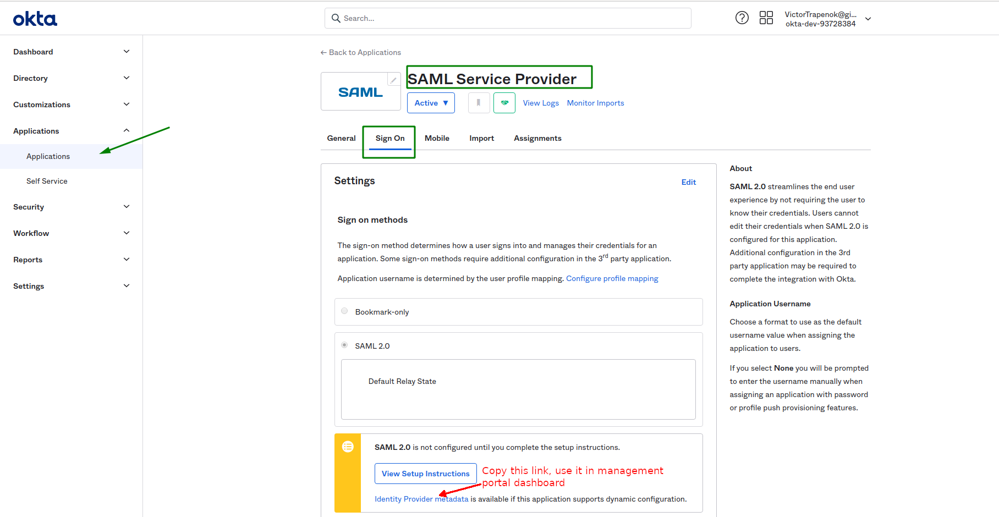
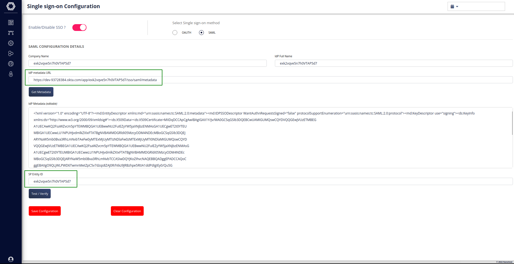

# SSO

## Okta config

- Go to okta dashboard ( https://developer.okta.com/signup/  login:victor.trapenok@nanoheal.com password: OtqyDq2smuDv4N28vbSwZfFN)
- Add `SAML Service Provider` application
- Go to `SAML Service Provider` application configuration

- Add `Assertion Consumer Service URL` (URL)
- Add `Service Provider Entity Id` (any custom string)

Example `https://sso-staging.nanoheal.work/api/saml/callback`

- Go managment portal dashboard
- Configure fields `IdP metadata URL` (Link from Okta dashboard with title `Identity Provider metadata`)
- Configure fields `SP Entity ID` (same as `Service Provider Entity Id` in okta dashboard)

