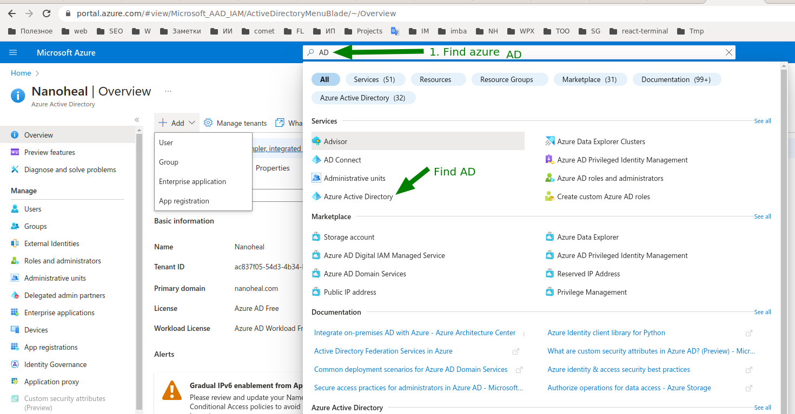
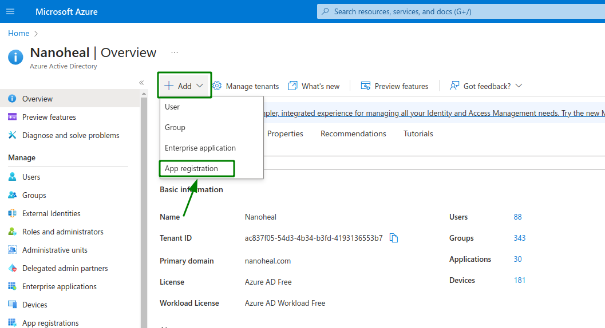
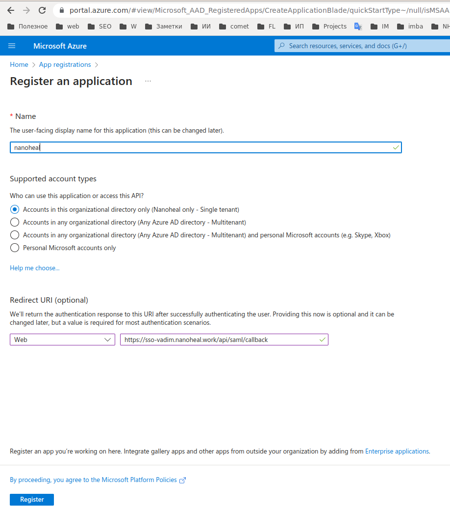
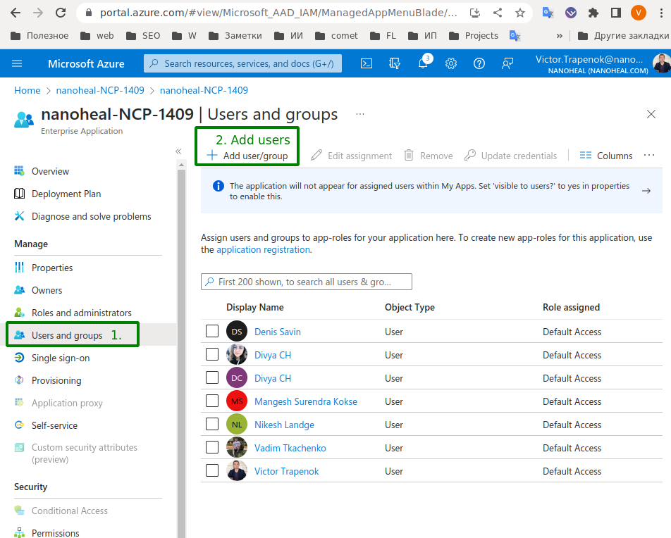
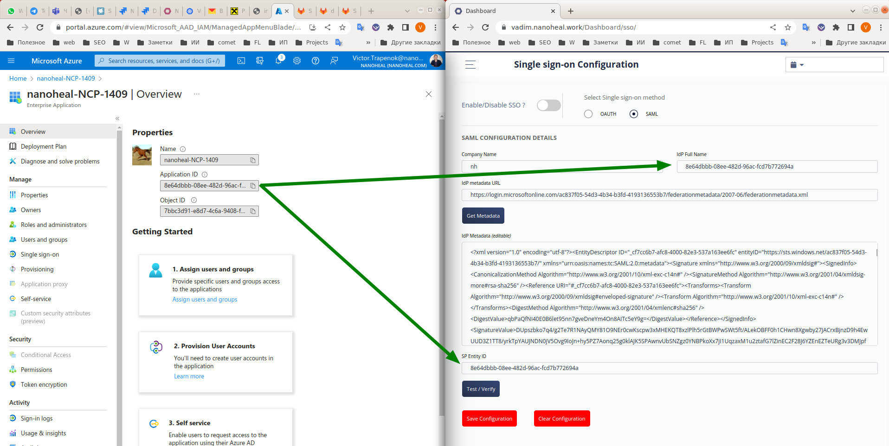
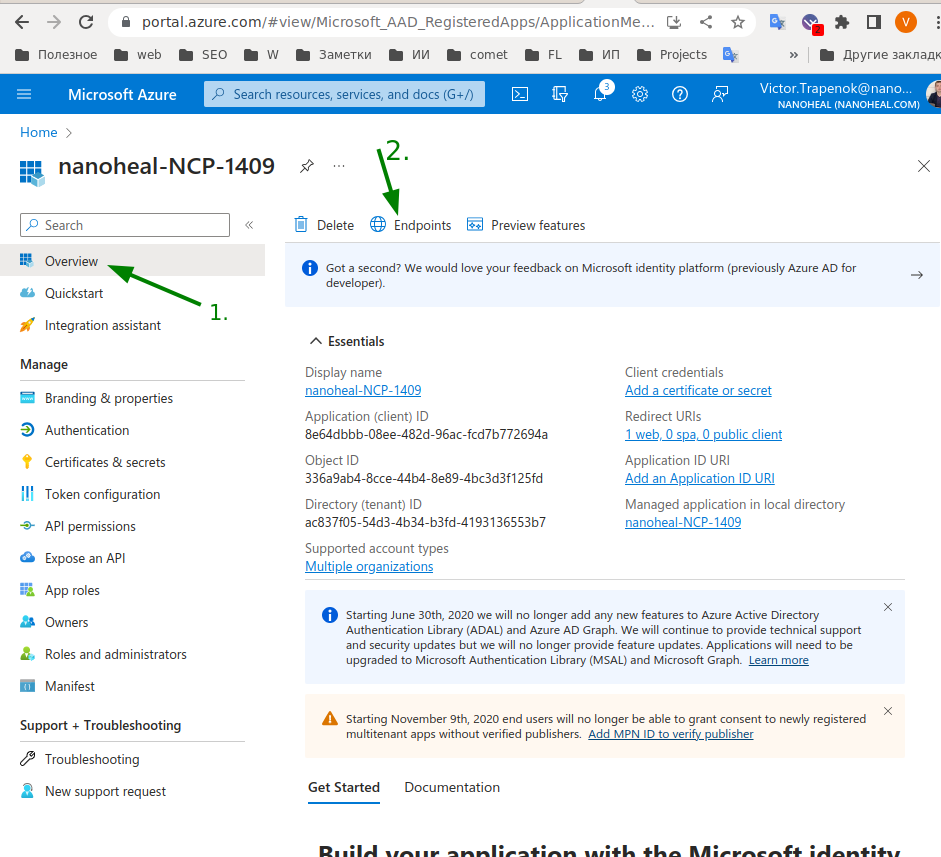
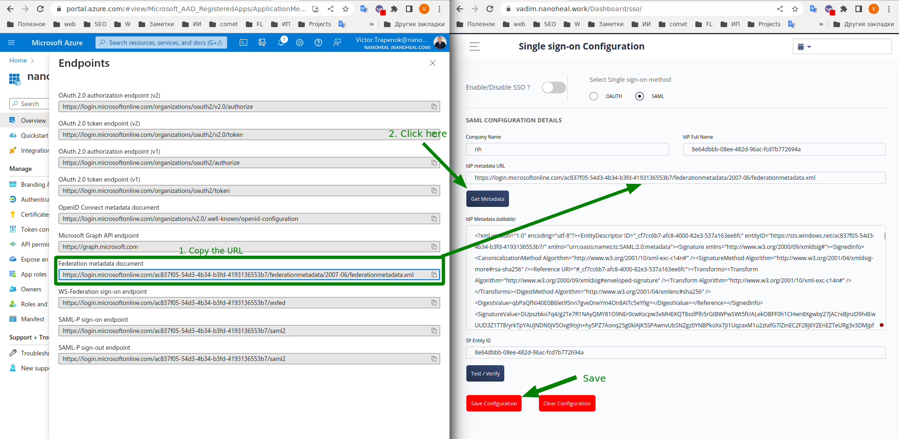

# SAML witth AzureAD

Create a new application

--

--

**On this step use your own domain for sso.**

--

Add users to the application

--

Copy `Application ID` to dashboard configuration

--

Configure `Federation metadata document`

Find endpoints for the application.

--

Copy `Federation metadata document` url and save it.

